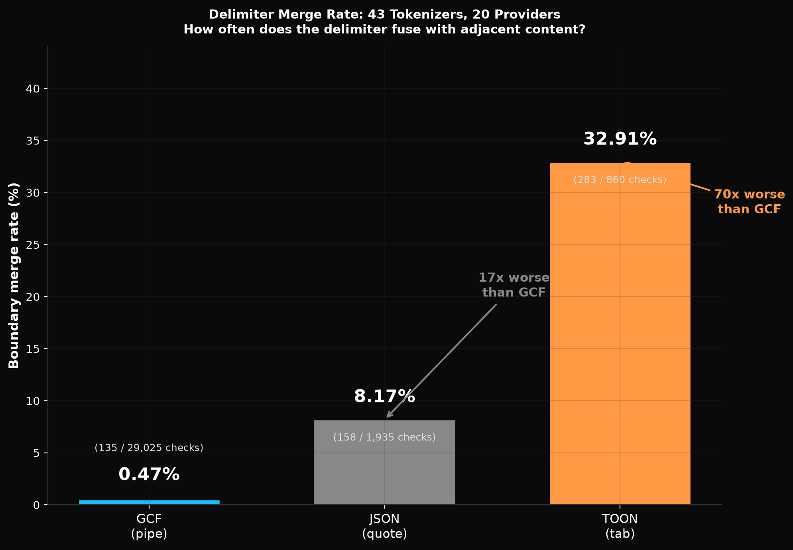
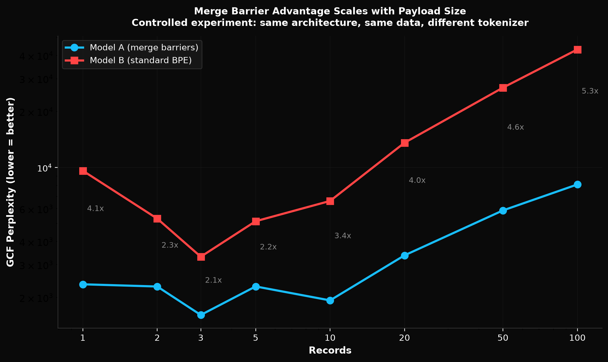
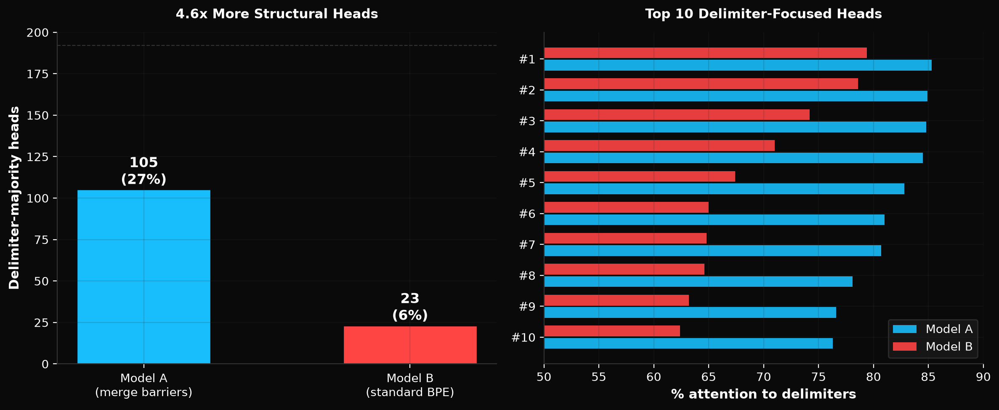
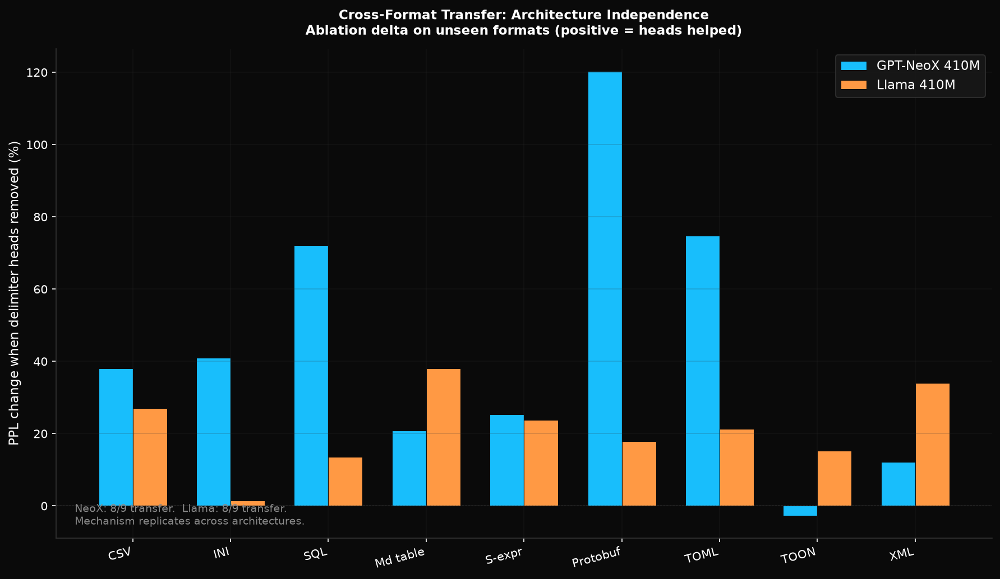

# Merge Barriers in BPE Tokenization

**How Tokenizer Design Causally Determines Attention Head Specialization**

Dayna Blackwell, Blackwell Systems

<p align="center">
  <a href="paper/merge-barriers-v3.pdf"></a>
  <a href="https://huggingface.co/blackwell-systems/merge-barriers"></a>
  <a href="https://doi.org/10.5281/zenodo.20925910"></a>
  <a href="LICENSE"></a>
</p>

<p align="center">
  
  
</p>
<p align="center">
  
  
</p>

## Why This Matters

Prior work has described what attention heads do in trained models (Voita et al., 2019; Olsson et al., 2022). This paper answers a different question: **what training conditions cause heads to specialize in the first place?**

The answer is the tokenizer. A single pre-training config choice (whether 16 delimiter characters can participate in BPE merges) determines whether the trained transformer develops concentrated delimiter-specialized attention heads, how many emerge, which layers they occupy, and whether they generalize to unseen formats. The fix is 16 lines of config. The finding is that a tokenizer constraint propagates through the entire training process and reshapes the model's internal architecture.

This is not just a performance improvement. The causal chain reveals how transformers organize themselves around structural boundaries: the B0 finding shows that GQA (shared KV projections) enables partial delimiter specialization even without merge barriers, while full MHA (separate KV projections) does not. Merge barriers amplify a latent capability that depends on attention architecture. No prior work has connected tokenizer design to attention head organization, or shown that the connection is architecture-dependent in this way.

## Results at a Glance

| Metric | NeoX (merge barriers vs standard) | Llama (merge barriers vs standard) |
|--------|-----------------------------------|-------------------------------------|
| GCF structured data PPL | **46x better** | **10x better** |
| Code comprehension (Python/Go/TS) | **3-5x better** | **5-8x better** |
| Natural language PPL | Identical (19.4 vs 19.5) | Identical (~23 vs ~21) |
| Delimiter-specialized heads | 50 vs 3 (non-functional) | 66 vs 35 (GQA enables partial) |
| Cross-format transfer (unseen formats) | 8/9 formats (+44.7% avg) | 8/9 formats (+21.4% avg) |
| Per-token delimiter prediction | 2.4x easier | 2.1x easier |

## The Fix: 16 Barrier Characters

During BPE tokenizer training, these characters are forbidden from participating in any merge operation:

```
|  @  <  >  "  '  :  ,  ;  \t  {  }  [  ]  (  )
```

No changes to the BPE algorithm, training loop, or model architecture. The constraint is a pre-tokenization rule (16 lines of config). The resulting tokenizer has zero merged delimiter entries and zero adversarial surface.

## What's New vs Prior Work

| Prior work | What they showed | What we add |
|-----------|------------------|-------------|
| Voita et al. (2019), Clark et al. (2019) | Heads specialize in trained models | We prove what *causes* specialization |
| Olsson et al. (2022) | Induction heads cause in-context learning | We prove delimiter heads cause structural comprehension |
| Deekeswar (2026), Matveev (2026) | JSON is token-inefficient | We explain *why* (delimiter merging) and fix it |
| Karim & Batatia (2025) | Fixed tokens for structure | We achieve this by construction with merge barriers |

This is the first controlled experiment connecting tokenizer design to attention head organization, and the first demonstration that the mechanism is architecture-independent.

## Key Findings

- **43 tokenizers from 20 providers**: delimiter merging is universal and irrecoverable
- **Controlled experiments** on GPT-NeoX 410M and Llama 410M (same corpus, same hyperparameters, only the tokenizer differs)
- **3-46x lower perplexity** on structured data with zero natural language cost
- **50-66 delimiter-specialized heads** emerge (identified via excess-score method)
- **18-phase causal ablation**: heads are necessary (+59% degradation when removed), sufficient (13% of heads beat the full model), and transfer to 8/9 unseen formats
- **Architecture-independent**: replicates on both GPT-NeoX (full MHA) and Llama (GQA 4:1)
- **B0 finding**: standard-BPE Llama develops 35 functional delimiter heads through GQA (NeoX develops 3 non-functional). Merge barriers amplify a capability GQA partially enables.

## Repository Contents

```
paper/                    # Paper (v3, 16K words, 27 references, 23 figures)
  revision-v3.md          # Markdown source
  merge-barriers-v3.pdf   # Rendered PDF

structok-64k.json         # Merge-barrier tokenizer (65,539 vocab, 16 barriers)
structok-256k.json        # 256K variant

eval_*.py                 # 23 evaluation/ablation scripts
runs/                     # 86 result files (JSON + logs) with full provenance

charts/                   # 39 chart PNGs + 5 generator scripts
generate_charts.py        # Root-level chart generator (11 charts)
```

## Reproducing Results

### Prerequisites

```bash
pip install torch transformers tokenizers matplotlib numpy
```

### Re-run ablation experiments

Download model checkpoints from [HuggingFace](https://huggingface.co/blackwell-systems/merge-barriers):

```bash
# NeoX ablation (18 phases)
python eval_ablation_v4_excess.py --model-a path/to/neox-a --model-b path/to/neox-b

# Llama ablation (12 phases)
python eval_llama_ablation.py --model-a path/to/llama-a --model-b path/to/llama-b

# KV-group ablation (Llama GQA methodology)
python eval_llama_b0_and_kvgroup.py --model-b path/to/llama-b
```

### Regenerate charts

```bash
cd charts
python generate_charts.py           # 6 ablation charts
python generate_experiment_charts.py # 5 experiment charts
python generate_remaining_charts.py  # 3 remaining ablation charts
python generate_run003_charts.py     # 5 run-003 charts
python attention_heatmap.py          # Attention heatmap
python density_vs_delta.py           # Transfer density analysis

cd ..
python generate_charts.py            # 11 run-002 charts
```

### Verify tokenizer claims

```python
from tokenizers import Tokenizer

tok = Tokenizer.from_file("structok-64k.json")

# Verify zero merged delimiter entries
vocab = tok.get_vocab()
barriers = set('|@<>"\':,;\t{}[]()')
for token, id in vocab.items():
    decoded = tok.decode([id])
    has_barrier = any(c in barriers for c in decoded)
    has_letter = any(c.isalpha() for c in decoded)
    if has_barrier and has_letter and len(decoded) > 1:
        print(f"MERGED: {repr(decoded)} (id={id})")
# Expected output: nothing (zero merged entries)
```

## Model Checkpoints

Available on [HuggingFace](https://huggingface.co/blackwell-systems/merge-barriers):

| Model | Architecture | Tokenizer | Steps | PPL |
|-------|-------------|-----------|-------|-----|
| NeoX A | GPT-NeoX 410M | structok-64k (merge barriers) | 20,000 | 19.4 |
| NeoX B | GPT-NeoX 410M | standard-64k (no barriers) | 20,000 | 19.5 |
| Llama A | Llama 410M (GQA 4:1) | structok-64k (merge barriers) | 40,000 | ~23 |
| Llama B | Llama 410M (GQA 4:1) | standard-64k (no barriers) | 40,000 | ~21 |

## Citation

```bibtex
@article{blackwell2026mergebarriers,
  title={Merge Barriers in BPE Tokenization: How Tokenizer Design Causally Determines Attention Head Specialization},
  author={Blackwell, Dayna},
  year={2026},
  url={https://github.com/blackwell-systems/merge-barriers}
}
```

## License

MIT

## Related

- [GCF: Graph Compact Format](https://github.com/blackwell-systems/gcf) (the wire format used as comparison format)
- [DOI: 10.5281/zenodo.20925910](https://doi.org/10.5281/zenodo.20925910)
