## Abstract

BPE tokenizers merge delimiter characters with adjacent content, hiding structural boundaries inside single tokens. We present an exhaustive tokenizer boundary study (43 tokenizers, 20 providers) showing that JSON's quote merges with field names on 30% of tokenizers, and introduce merge barriers: 16 delimiter characters forbidden from participating in BPE merges.

We prove through controlled experiments on two architectures that this single tokenizer change causally determines attention head specialization. On GPT-NeoX 410M (20K steps) and Llama 410M (RoPE, GQA, SwiGLU, 40K steps), the merge-barrier model develops 50-66 delimiter-specialized heads (identified via excess-score method). Causal ablation establishes a four-layer hierarchy:

**Layer 1 (tokenizer):** The merge-barrier model achieves 3-46x lower perplexity on structured data (46x on NeoX, 10x on Llama for GCF), with zero natural language cost.

**Layer 2 (whole model):** Per-token delimiter prediction is 2.1-2.4x better. This advantage is distributed across all parameters, not localized to specialized heads. Ablating delimiter heads does not spike loss back to standard-BPE levels.

**Layer 3 (specialized heads):** 50-66 delimiter heads are causally necessary for format-level comprehension (+59% degradation on NeoX when removed). On NeoX, 13% of heads alone outperform the full 384-head model on structured data (sufficiency not cleanly demonstrated on Llama due to GQA). JSON attention saturates identically on both architectures (99.1% on NeoX, 99.2% on Llama).

**Layer 4 (cross-format transfer):** Delimiter heads generalize to 8 of 9 unseen formats (+44.7% average degradation across all 9 when removed on NeoX, +21.4% on Llama). Transfer is universal, not format-specific.

Architecture independence is confirmed with nuanced GQA effects: Llama's shared KV projections moderate the advantage magnitude, push structural processing to earlier layers, and enable partial delimiter specialization even without merge barriers (35 functional heads on standard Llama vs 3 non-functional on NeoX). This is the first controlled experiment connecting tokenizer design to attention head organization, and the first demonstration that the mechanism is architecture-independent.

**Keywords:** BPE tokenization, merge barriers, structural ambiguity, attention heads, delimiter specialization, causal ablation, architecture independence, GQA

---

## 1. Introduction

When structured data enters an LLM's context window, it passes through a tokenizer that converts characters to integer IDs. BPE tokenizers merge frequent byte sequences, which means delimiter characters (quotes, colons, braces, tabs, pipes) routinely fuse with adjacent content. The string `"name` becomes a single token. The model receives one integer where there should be a structural boundary.

Prior work has noted JSON's token overhead (Deekeswar, 2026), explored structured tokenization (Karim and Batatia, 2025), and studied attention head specialization in trained models (Voita et al., 2019; Clark et al., 2019; Olsson et al., 2022). But no prior work has: (1) quantified delimiter merging systematically across production tokenizers, (2) proposed a specific fix, (3) proven causally that the fix produces attention head specialization, or (4) demonstrated architecture independence of the mechanism.

This paper makes five contributions:

1. **Quantifying delimiter corruption.** An exhaustive analysis of 43 tokenizer vocabularies showing that delimiter merging is universal, deterministic, and irrecoverable (Section 3).

2. **The fix.** BPE merge barriers: 16 delimiter characters forbidden from participating in any merge operation during tokenizer training (Section 4).

3. **The causal proof.** Controlled experiments on two architectures (GPT-NeoX 410M and Llama 410M) with 18-phase ablation establishing that delimiter heads are necessary, sufficient, and causally responsible for structured data comprehension (Sections 5-7).

4. **Architecture independence.** The mechanism replicates on Llama (RoPE, GQA, SwiGLU, RMSNorm), with GQA moderating the effect magnitude. A new KV-group ablation methodology for GQA architectures is introduced (Section 8).

5. **The causal hierarchy.** A four-layer framework: tokenizer (root cause) > whole-model improvement > specialized heads > cross-format transfer. The heads are the specialized expression of a holistic improvement, not detachable modules (Section 9).

We use Graph Compact Format (GCF), a header-factored wire format with pipe delimiters, as the comparison format. GCF was selected because its grammar characters have near-zero merge rates across all 43 tested tokenizers.

---

## 2. Background

### 2.1 BPE Tokenizers

Modern LLMs use Byte-Pair Encoding (BPE) tokenizers (Sennrich et al., 2016) trained on large text corpora, with SentencePiece (Kudo and Richardson, 2018) as the dominant implementation. Alternative subword methods exist, including Unigram language models (Kudo, 2018), but BPE remains the standard for GPT-family and Llama-family models. BPE builds a vocabulary by iteratively merging the most frequent byte sequences. The result is a fixed lookup table mapping strings to integer IDs. At inference time, the tokenizer greedily matches the longest vocabulary entry at each position. If `"name` exists as entry #32586, the tokenizer always selects it as one token. This is deterministic: a dictionary lookup, not a context-dependent decision.

### 2.2 Grammar vs. Payload

Any structured format contains grammar symbols (delimiters defining structure) and payload content (data values). In JSON, the grammar symbols are `"`, `:`, `,`, `{`, `}`, `[`, `]`. Grammar symbols repeat on every row; payload content varies.

When grammar symbols merge with payload during BPE training, the resulting token conflates structural markup with semantic content. The token `"name` (GPT-4 #32586) encodes both "opening quote" (grammar: a field boundary starts here) and "name" (payload: this is the field called name). The model must decompose these two meanings from within a single embedding rather than reading the boundary from a dedicated grammar token. Each row of a JSON array contains the same `"name":` pattern, producing the same merged token. The ambiguity compounds linearly with data size: 10 rows produce 10 merged boundaries to decompose, 500 rows produce 3,000. At scale, grammar tokens dominate the input sequence (Section 3.4), and the merged boundaries make it increasingly difficult for the model to distinguish structure from content.

### 2.3 Structural Equivalence

Two models achieve structural equivalence when they see field boundaries at the same token positions. They may tokenize values differently (semantic variance, which is harmless), but they agree on where structure is. For example, GPT-4 and Claude both tokenize the value `"pending"` differently (GPT-4: 2 tokens, Claude: 3 tokens), but this does not affect comprehension because both models know where the value starts and ends.

When models disagree on where fields start and end, they are parsing different structures from the same input. GPT-4 sees `["value][":"]` (boundary inside first token), while Claude sees `["][value][":"]` (boundary at token edge). These models receive different structural signals from the same data, which produces model-dependent comprehension failures. A format achieves structural equivalence when all tokenizers place field boundaries at the same token positions. Our analysis shows GCF achieves 99.5% structural equivalence across all 43 tokenizers (Section 3.5); JSON achieves 7.5%.

### 2.4 Head Specialization

Attention heads in transformers specialize during training. Voita et al. (2019) identified positional, syntactic, and rare-word heads in BERT. Michel et al. (2019) demonstrated that most heads can be pruned without significant loss. Olsson et al. (2022) proved that "induction heads" are causally responsible for in-context learning, building on the mathematical framework for transformer circuits (Elhage et al., 2021). Conmy et al. (2023) developed automated methods for discovering such circuits. These studies are descriptive: they observe what heads do in existing models. None address what training conditions cause heads to specialize. Our work fills this gap: we prove that tokenizer design causally determines whether concentrated delimiter specialization develops.

---

## 3. The Problem: 43 Tokenizers, Universal Merging

### 3.1 Tokenizers Tested

We tested 43 tokenizers from 20 providers: OpenAI (cl100k, o200k, GPT-2), Anthropic (Claude), Meta (LLaMA 2/3/3.1, CodeLlama, TinyLlama), Google (Gemma 2/3, T5), Mistral (7B v0.1/v0.3, Nemo, Mixtral, Codestral), Alibaba (Qwen 2/2.5/3, QwQ), DeepSeek (V2/V3/R1), Microsoft (Phi-2/3/4), TII (Falcon), 01.AI (Yi), BigCode (StarCoder2), NVIDIA (Nemotron), AI21 (Jamba), Stability (StableLM), EleutherAI (Pythia), Snowflake (Arctic), AllenAI (OLMo), and Alibaba AIDC (Marco-o1). Vocabulary sizes range from 32K to 262K.

### 3.2 Field Boundary Merge Rates

{ width=85% }

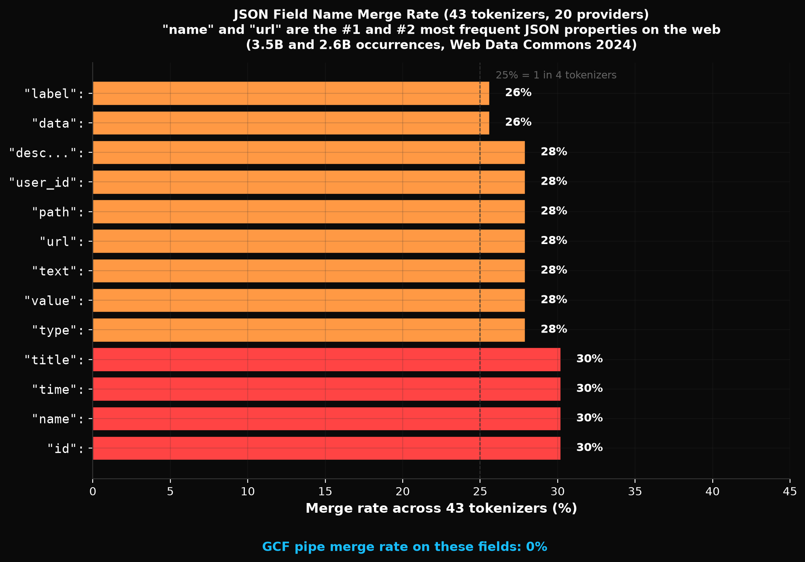{ width=85% }

The most common JSON field names merge with the opening quote on 30% of tokenizers:

| Field Pattern | Merge Rate | Affected Families |
|--------------|-----------|-------------------|
| `"id":`, `"name":`, `"time":`, `"title":` | 30.2% (13/43) | GPT-4, GPT-4o, LLaMA 3.x, Qwen, Phi-4, StableLM, Mistral Nemo |
| `"type":`, `"value":`, `"url":`, `"text":` | 27.9% (12/43) | Same minus Mistral Nemo |

According to Web Data Commons (University of Mannheim, 2024), `name` is the #1 most common JSON property on the web (3.5 billion occurrences). It merges on 30% of tokenizers.

On real evaluation data across 43 tokenizers (check counts vary by format due to different field counts):

| Format | Merge Rate | Total Checks |
|--------|-----------|-------------|
| GCF (pipe) | **0.47%** | 29,025 |
| JSON (quote) | **8.17%** | 1,935 |
| TOON (tab) | **32.91%** | 860 |

#### The merge mechanism

The variance has a specific cause: BPE merging absorbs the opening quote into the field name. When GPT-4's tokenizer encounters `"value":"pending"`, it produces:

```
["value] [":"] [pending] ["]    (4 tokens)
```

Claude's tokenizer produces:

```
["] [value] [":"] [pending] ["]    (5 tokens)
```

The structural boundary (where the field name starts) is at a different token position. On GPT-4, the opening quote is fused with content. On Claude, it is separate. The model must learn to decompose the merged token `"value` into "opening quote followed by a field name" rather than treating it as a single semantic unit.

By contrast, GCF's pipe delimiter is always its own token on all 43 tokenizers:

```
value|pending     -> [value][|][pending]     ALL 43 tokenizers
name|Alice        -> [name][|][Alice]        ALL 43 tokenizers
orderId|ORD-001   -> [orderId][|][ORD][-][001]  ALL 43 tokenizers
```

#### Specific token IDs

These are actual dictionary entries with specific IDs, not hypothetical merges:

| Pattern | GPT-4 | GPT-4o | LLaMA 3 | Qwen 2.5 | DeepSeek | Mistral | Claude | Gemma |
|---------|-------|--------|---------|----------|----------|---------|--------|-------|
| `"id` | #29800 | #60094 | #29800 | #28700 | -- | #117579 | -- | -- |
| `"name` | #32586 | #74800 | #32586 | #31486 | -- | #117753 | -- | -- |
| `"type` | #45570 | #91290 | #45570 | #44470 | -- | -- | -- | -- |
| `"value` | #64407 | #180654 | #64407 | #63307 | -- | -- | -- | -- |
| `"url` | #61360 | #124415 | #61360 | #60260 | -- | -- | -- | -- |

Cross-verified: encoding `"name":"Alice"` with GPT-4's tokenizer confirms token #32586 is selected.

#### Maximum tokenization variance

Searching across 840 JSON field+value patterns, the maximum variance case is `"userName":"req_xyz789"`, which produces 7 distinct tokenizations across 8 models:

```
GPT-4, LLaMA:     ["][userName][":"][req][_xyz][789]["]
GPT-4o:           ["user][Name][":"][req][_xyz][789]["]
Claude:           ["][userName][":"][req][_][xyz][789]["]
Qwen 2.5:         ["][userName][":"][req][_xyz][7][8][9]["]
DeepSeek V3:      ["][user][Name][":"][req][_][xyz][789]["]
Gemma 2:          ["][userName][":"][req][_][xyz][7][8][9]["]
Mistral Nemo:     ["][user][Name][":"][req][_x][yz][7][8][9]["]
```

A complete JSON object `{"orderId":"ORD-001","value":"shipped"}` produces 4 different token counts (12, 13, 14, 15) depending on the model. The same data is literally a different length on different model families, affecting attention patterns, positional encodings, and context budget.

### 3.3 Adversarial Surface

We decoded every entry in all 43 vocabularies and classified entries where delimiter characters fuse with alphabetic content:

| Delimiter | Unique Mergeable Words | Used by |
|-----------|----------------------|---------|
| `\|` (pipe) | **24** | GCF |
| `"` (quote) | **193** | JSON |
| `:` (colon) | **232** | JSON |
| `,` (comma) | **282** | JSON |
| `\t` (tab) | **1,238** | TOON |

JSON's total adversarial surface across all 7 grammar characters: **1,939 words**. That is 81x the pipe's 24. GPT-4 has 1,173 tab+letter vocabulary entries. TOON chose the delimiter with the largest adversarial surface of any common separator character.

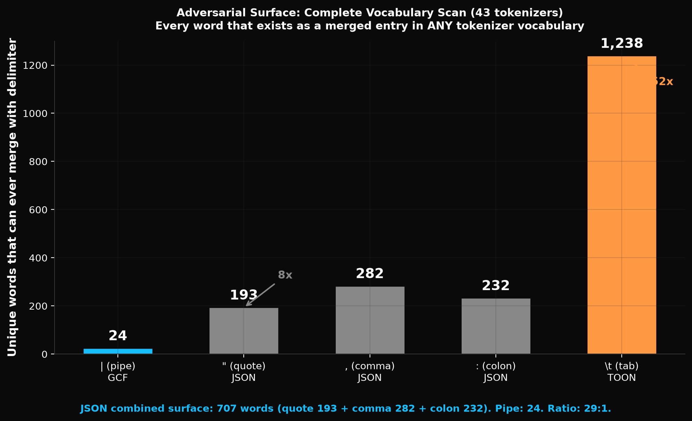{ width=85% }

#### Multi-grammar vocabulary entries

Some vocabulary entries contain multiple JSON grammar symbols fused together:

| Token | Grammar Operations | Present In |
|-------|-------------------|------------|
| `":"` | close string, start key-value, open string | 43/43 tokenizers |
| `","` | close string, separate elements, open string | 43/43 tokenizers |
| `{"` | open object, open string | 43/43 tokenizers |
| `":{"` | close string, key-value, open object, open string | 43/43 tokenizers |
| `"},` | close string, close object, separate | 43/43 tokenizers |
| `},{"` | close object, separate, open object, open string | 33/43 tokenizers |

The token `":{"` packs four structural operations into one integer. The model receives one token where there should be four grammar decisions.

#### Pipe merge entries

The pipe has 24 merged entries across all 43 vocabularies, but exclusively with programming keywords from type union syntax: `|null`, `|string`, `|max`, `|min`, `|required`. The entries `|name`, `|id`, `|type`, `|value`, `|status`, `|title` do not exist in any tested vocabulary. The pipe merges with type-system keywords, not with field names. This is a dictionary fact, not a statistical claim.

#### ASCII character safety ranking

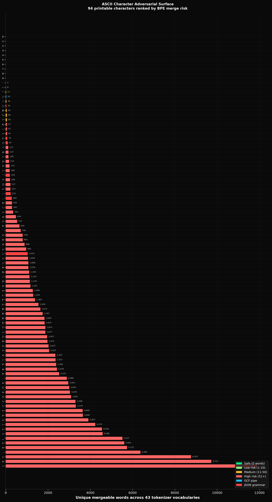{ width=85% }

We scanned all 94 printable ASCII characters (codes 33-126) across all 43 vocabularies:

| Tier | Characters | Mergeable words |
|------|-----------|----------------|
| Safe (0 words) | `0-9` | 0 (digits never merge with adjacent text) |
| Low risk (1-10) | `` ` `` `~` | 5-8 |
| Medium (11-50) | `^` `\|` `!` `]` `#` `%` `?` | 17-50 (pipe at 24) |
| High (51-100) | `&` `;` `+` `}` `{` | 57-97 |
| Very high (101+) | `"` `:` `,` `[` `(` `-` `.` `_` letters | 117-11,891 |

Digits are the only perfectly safe characters, but cannot serve as delimiters (they appear in payload data). Backtick (5 words) and tilde (8 words) have smaller surfaces than pipe (24), but both have practical drawbacks (backtick conflicts with markdown and template literals; tilde with paths and bitwise negation). The pipe was selected because its 24 mergeable words are all TypeScript union keywords, none of which appear as data field names, and it provides superior visual readability as a column separator.

### 3.4 Token Overhead

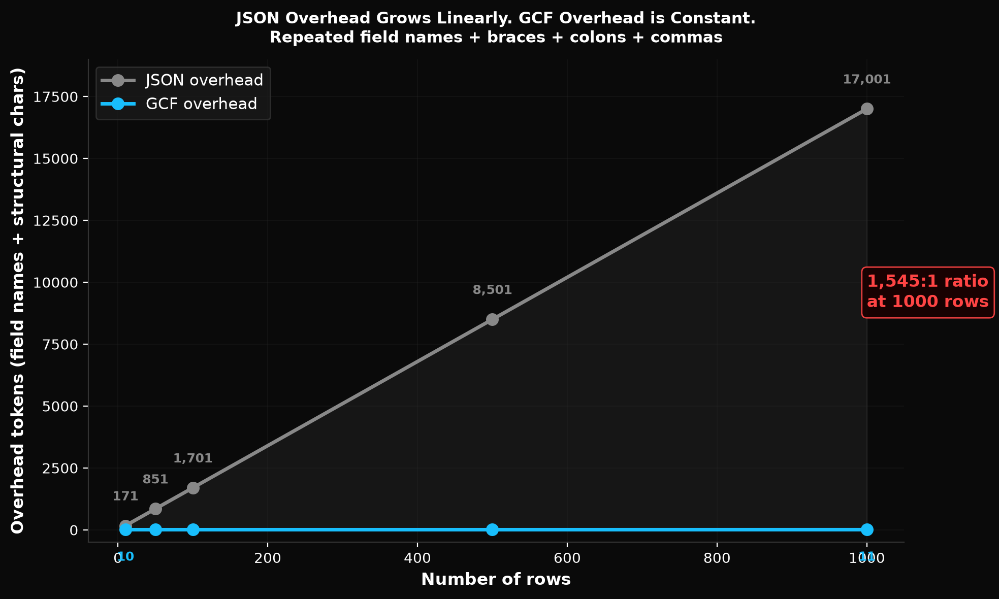{ width=85% }

At 500 rows, JSON's token distribution:

| Category | % of Tokens |
|----------|------------|
| Repeated field names | 52.4% |
| Structural characters | 28.6% |
| Actual data values | **19.0%** |

81% overhead. Only 19% carries information.

GCF for the same 500-row data:

| Category | % of Tokens |
|----------|------------|
| Section header (declared once) | 0.4% |
| Delimiter characters | 1.9% |
| Actual data values | **97.7%** |

GCF's overhead is 2.3%. JSON's is 81%. The difference is structural: GCF declares field names once in a header (`## orders [500]{orderId,customer,status,total}`) rather than repeating them on every row.

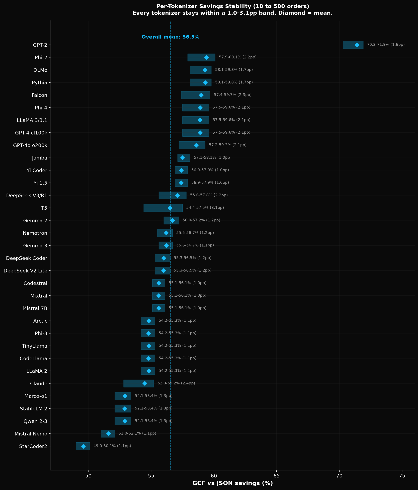{ width=85% }

#### Grammar swap experiment

To confirm that token savings are a structural property (header factoring) and not an artifact of specific delimiter choices, we replaced all GCF delimiters with 4 alternative sets (all drawn from the non-merging character set) and re-measured savings across 5 payload types, 4 sizes, and 8 tokenizers (800 measurements). The spread across all delimiter sets was 0.4 percentage points. The savings come from eliminating repeated field names, not from using a particular delimiter character.

### 3.5 Structural Equivalence Proof

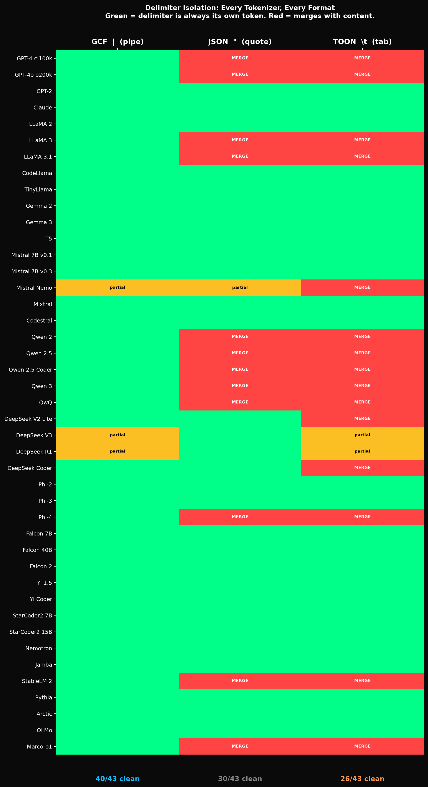{ width=85% }

We measured structural equivalence by testing whether each grammar character tokenizes as its own token (isolated) or fuses with adjacent content (merged) across all 43 tokenizers.

GCF grammar maintains 99.5% isolation: `@` is isolated on 43/43 tokenizers (100%), `<` on 43/43 (100%), `|` on 42.66/43 (99.2%; the 0.8% comes from `|null` and `|string` entries on tokenizers trained heavily on TypeScript). Every GCF field boundary is at a token edge on virtually every production tokenizer. Two different models processing the same GCF payload see the same structural boundaries.

JSON grammar fuses into multi-operation tokens on 43/43 tokenizers. Of all vocabulary entries containing the quote character, 92.5% encode multiple grammar operations (e.g., `":"` encodes close-string + key-value-separator + open-string as a single token). The quote is isolated on only 3 tokenizers (Claude, Gemma 2, Gemma 3). On the remaining 40, field boundaries are inside merged tokens, producing the model-dependent tokenization variance documented in Section 3.2.

The structural equivalence gap (99.5% vs 7.5%) is not a property of specific tokenizers or training data; it is a property of which characters the format uses as delimiters. Any format using pipe, `@`, and `<` as grammar inherits the 99.5% isolation. Any format using quote, colon, and comma inherits the 7.5%. This is why merge barriers (Section 4) fix the problem for all formats simultaneously: isolating the 16 most-used delimiter characters brings every format closer to 100% structural equivalence.

### 3.6 Irrecoverability

The problem cannot be fixed for existing models:

1. Vocabulary is frozen post-training.
2. All weights depend on the vocabulary (token #32586 has learned embeddings in every layer).
3. Tokenization occurs before the transformer processes input.
4. Changing the tokenizer requires retraining the model from scratch.

No amount of fine-tuning, RLHF, or prompt engineering can change the fact that `"name` is a single token in GPT-4's dictionary.

### 3.7 Attention Mechanism on Pre-Existing Models

Before presenting our fix, we establish the transformer-level mechanism by which tokenizer merging causes comprehension failure, using pre-existing models (Pythia 410M, Gemma 2B).

#### Entropy crossover

Attention entropy measures how spread out the model's attention is. High entropy means diffuse attention (looking everywhere, finding nothing). Low entropy means focused attention (knows where to look).

At small scale (5-20 orders), JSON entropy is lower than GCF. The model has been trained on billions of JSON examples and has efficient attention patterns. At 50 orders, the crossover: JSON entropy exceeds GCF by 13%. The model's learned JSON parsing breaks down as thousands of identical token IDs compete for attention.

#### Grammar attention collapse

We classified every token as grammar or payload and measured attention allocation:

At small scale, JSON attention splits roughly 30% grammar / 68% payload. The model attends to structural tokens to understand the format. At 50 orders, JSON grammar attention collapses from 30% to 8.6%. The model stops attending to structural tokens. It distributes attention uniformly across content, unable to distinguish structure from data.

This is the mechanism behind comprehension failure. It is measurable, reproducible, and directly caused by the tokenizer producing merged boundary tokens that become indistinguishable at scale.

Ildiz et al. (2024) proved mathematically that self-attention weights tokens proportionally to their frequency in the input sequence. Their Context-Conditioned Markov Chain (CCMC) formulation shows that P(next_token = j | X) includes m_j (the count of token j) in the numerator. When structural tokens like `"name":` account for 80% of occurrences in a 500-row JSON array, they dominate the attention budget by count, leaving proportionally less for data values. The paper analyzes single-layer models; our comprehension data confirms the effect persists in production multi-layer architectures at 500+ rows.

#### Comprehension correlation

The tokenization analysis connects to observed outcomes from independent comprehension evaluations across 10 frontier models (Blackwell, 2026):

- JSON accuracy at 500 records: **54.1%**
- GCF accuracy at 500 records: **91.2%**
- GCF accuracy on standard workloads: **100%** on every frontier model

Error magnitude confirms the mechanism: GCF errors are small (off by 1-2, precision errors). JSON errors are large (off by 50-140, comprehension failures). The model did not slightly misread a number; it could not find the answer.

---

## 4. The Fix: Merge Barriers

### 4.1 Concept

Standard BPE (Sennrich et al., 2016) iteratively merges the most frequent adjacent byte pairs in the training corpus. When the corpus contains JSON, the pair `"` + `n` (from `"name"`, `"null"`, etc.) eventually crosses the frequency threshold and merges into a single vocabulary entry. Once merged, the tokenizer always selects it: `"name` becomes token #32586 in GPT-4. The merge is permanent and deterministic.

Merge barriers add a single constraint: 16 delimiter characters are forbidden from participating in any merge operation. The BPE algorithm itself is unchanged; the merge candidate list simply excludes pairs containing a barrier character. During tokenizer training, the pair `"` + `n` is never considered, regardless of its frequency. The barrier is enforced at the pre-tokenization stage (Kudo and Richardson, 2018), before BPE merging begins.

The result: every barrier character is always its own token. `"name` can never become a single token because `"` cannot merge with `n`. The model always sees explicit structural boundaries. This is the same guarantee that byte-level models like ByT5 (Xue et al., 2022) achieve by eliminating subword tokenization entirely, but without sacrificing BPE's compression efficiency on natural language.

The tradeoff is quantifiable. Merge barriers prevent delimiters from merging into adjacent content, but the freed content bytes can form different (sometimes more efficient) merges. The net effect depends on delimiter density: on GCF, the merge-barrier tokenizer produces 14-19% fewer total tokens (113 vs 131 at 5 records, 1,855 vs 2,288 at 100 records); on natural language, ~3% more. The comprehension benefit (3-46x lower perplexity on structured data) far exceeds any compression cost.

### 4.2 Barrier Characters

16 characters selected for maximum structural coverage across structured data formats and code:

| # | Character | Purpose |
|---|-----------|---------|
| 1 | `\|` | Field delimiter (GCF, shell pipes, markdown tables) |
| 2 | `@` | Symbol IDs (GCF), email, decorators |
| 3 | `<` | Edge direction (GCF), HTML/XML tags, comparisons |
| 4 | `>` | Edge direction (GCF), HTML/XML tags, comparisons |
| 5 | `"` | String delimiter (JSON, YAML) |
| 6 | `'` | String delimiter (YAML, code) |
| 7 | `:` | Key-value separator (JSON, YAML, Python) |
| 8 | `,` | Field separator (JSON, CSV, function arguments) |
| 9 | `;` | Statement terminator (code, CSV alternate) |
| 10 | `\t` | Column delimiter (TSV, TOON, indentation) |
| 11 | `{` | Open object (JSON, YAML), open block (code) |
| 12 | `}` | Close object (JSON, YAML), close block (code) |
| 13 | `[` | Open array (JSON), indexing |
| 14 | `]` | Close array (JSON), indexing |
| 15 | `(` | Open group (function calls, expressions) |
| 16 | `)` | Close group (function calls, expressions) |

This is not a format-specific fix. It fixes JSON, YAML, CSV, TOON, GCF, and any format that uses delimiter characters.

### 4.3 Implementation

In HuggingFace `tokenizers` (the SentencePiece-compatible library used by most open-source LLMs), merge barriers are implemented as pre-tokenization rules that isolate barrier characters before BPE merging begins. Each barrier character is wrapped in a `Split(char, behavior="isolated")` pre-tokenizer, which segments the input so that the character appears alone in its own segment. When BPE then processes each segment independently, the barrier character has no adjacent bytes to merge with. The full configuration is in Appendix A.

This approach requires no modifications to the BPE algorithm, the training loop, or the model architecture. The constraint is entirely in the pre-tokenization stage, making it compatible with any BPE-based training pipeline. The 16 `Split` rules compose in a `Sequence` pre-tokenizer, followed by the standard `ByteLevel` pre-tokenizer that handles the remaining text. Training time is unchanged; the only difference is the input segmentation.

The resulting tokenizer has 65,539 vocabulary entries (3 more than the 65,536 standard-BPE control, due to the barrier characters each receiving their own entries). It produces slightly more tokens on structured data (each delimiter is its own token rather than merging into adjacent content) but the same or fewer tokens on natural language, where the barrier characters appear infrequently.

### 4.4 Validation

We validated the trained tokenizer (structok-64k) through three independent checks:

1. **Exhaustive vocabulary scan.** Decoded every entry in the 65,539-entry vocabulary and verified that no entry contains a barrier character fused with alphabetic content. Result: **zero** merged delimiter entries. Compare to GPT-4's 117 quote+letter entries and 1,173 tab+letter entries.

2. **Adversarial surface measurement.** Applied the same adversarial surface analysis used on all 43 production tokenizers (Section 3.3). Result: **zero** adversarial surface. No barrier character appears inside any vocabulary entry alongside a letter. The attack surface that spans 1,939 words on JSON's grammar and 1,238 words on tab is eliminated entirely.

3. **Boundary isolation checks.** Tested 521 field+value patterns across all 16 barrier characters, verifying that each barrier character tokenizes as its own token in every context. Result: 521/521 passed. The isolation is deterministic: because barrier characters cannot participate in merges, they are always their own tokens regardless of surrounding content.

---

## 5. Controlled Experiments

### 5.1 Design

We trained four models in two controlled pairs, each differing only in the tokenizer. The experimental design isolates a single variable: within each pair, the architecture, corpus, hyperparameters, random seed, and hardware are identical. The only difference is whether 16 delimiter characters can participate in BPE merges.

| Pair | Architecture | Steps | Context | Params |
|------|-------------|-------|---------|--------|
| Run-002 | GPT-NeoX 410M (24 layers, 16 heads, 1024 hidden) | 20,000 | 2,048 | 436M |
| Run-003 | Llama 410M (RoPE, GQA 4:1 [16 query/4 KV per layer], SwiGLU, RMSNorm) | 40,000 | 2,048 | 405M |

Both pairs used the same corpus (4.5 GB; major components: 33% FineWeb, 13% code, 14% JSON, 8% GCF, 1% YAML/CSV, 3% Wikipedia; remaining 28% additional FineWeb). Same hyperparameters within each pair.

#### Run-002 (NeoX) detail

| | Model A (merge barriers) | Model B (standard BPE) |
|---|---|---|
| Architecture | GPT-NeoX 410M (436M params) | GPT-NeoX 410M (436M params) |
| Tokenizer | structok-64k (65,539 vocab, 16 barriers) | standard-64k (65,536 vocab, no barriers) |
| Training data | Same corpus (4.5 GB) | Same corpus (4.5 GB) |
| Pre-tokenized | 1,258,728,671 tokens | 1,269,271,190 tokens |
| Steps | 20,000 | 20,000 |
| Batch size | 32 effective (8 x 4 GPUs) | 32 effective |
| Learning rate | 3e-4 flat | 3e-4 flat |
| Hardware | 4x A100 PCIE 40GB | 4x A100 PCIE 40GB |
| Training | DDP with NCCL, gradient checkpointing, fp16 | Same |
| Final overall PPL | **19.4** | **19.5** |

Note: "Final overall PPL" is the perplexity observed during training (averaged across batches at step 20,000). The checkpoint stores the final batch loss, which differs from the running average.

We chose two architectures to test architecture independence. GPT-NeoX (Black et al., 2022) uses learned position embeddings, full multi-head attention (separate Q/K/V per head), GELU activation, and LayerNorm. Llama (Touvron et al., 2023) uses RoPE (Su et al., 2021), Grouped Query Attention (Ainslie et al., 2023; extending Shazeer, 2019) with 4 query heads sharing each KV head, SwiGLU (3 projections instead of 2), and RMSNorm. These represent the two major architectural families in production: NeoX-style (GPT-2/3, Pythia) and Llama-style (Mistral, Qwen, DeepSeek, Gemma). If the mechanism works on both, it is architecture-independent.

Run-003 used 40,000 steps (vs 20,000 for NeoX) because GQA with fewer attention parameters per layer converges slower. The Llama model has 7% fewer total parameters (405M vs 436M) due to the GQA reduction in KV projections. Both architectures reached comparable final PPL (~19-23 on overall training loss), confirming convergence despite the different training lengths.

### 5.2 Head Identification: Excess Scores

Identifying which heads specialize on delimiters requires correcting for the base rate of delimiter tokens in the probing text. A naive threshold ("heads where >50% of attention goes to delimiters") is biased by format: JSON has 75.7% delimiter positions, so a uniform-attention head that distributes attention randomly across all positions would score 0.757. Without correction, this inflates head counts (168 apparent delimiter heads on NeoX, vs 50-66 after correction).

We use excess delimiter attention: the raw attention fraction minus the base rate. A head with 0.60 raw attention on a text where 0.45 of positions are delimiters has an excess score of 0.15: it attends to delimiters 15 percentage points more than chance. A head with 0.80 raw on JSON (0.757 base rate) has excess 0.043: it barely exceeds chance despite its high raw score.

Each head is probed on 4 texts spanning different delimiter densities: GCF generic (35% delimiter positions), GCF graph (38%), JSON (76%), and YAML (42%). The excess scores are averaged across all 4 texts. This averaging reduces sensitivity to any single format's delimiter density and identifies heads that consistently specialize across formats.

Primary threshold: 0.15 excess. We also report counts at 0.10 and 0.20 for sensitivity analysis. On Llama, counts range from 85 (threshold 0.10) to 31 (threshold 0.20), with the primary 0.15 yielding 66. The causal findings (necessity, sufficiency, cross-format transfer) are internally consistent across all three thresholds.

### 5.3 Ablation Method

Our ablation methodology follows the zero-ablation approach established in the mechanistic interpretability literature (Olsson et al., 2022; Michel et al., 2019): for each ablation, we deep copy the model, zero the output projection weights for selected heads, measure per-format perplexity on held-out test data, then discard the copy. The original model is never modified. Each ablation is an independent measurement.

**Why zero-ablation, not mean-ablation or resampling.** Zero-ablation (setting output weights to zero) completely removes a head's contribution to the residual stream. Mean-ablation (replacing activations with their mean) and resampling-based methods (Conmy et al., 2023) preserve the head's average contribution, which can mask causal effects when the head's value comes from its variance across positions rather than its mean. For delimiter heads, the signal is precisely positional: they attend differently to delimiter vs content positions. Mean-ablation would preserve a diluted version of this signal, understating the causal effect. Zero-ablation is the stronger test.

**Controls.** Every delimiter head ablation is paired with a random head control: the same number of randomly selected non-delimiter heads are ablated, and the same metrics are measured. The causal signal is the gap between delimiter and random ablation, not the absolute direction of either. This controls for the generic effect of reducing model capacity. In some cases (particularly on Llama with GQA), removing any set of heads produces a regularization effect that improves performance on some formats. The delimiter-vs-random gap isolates the specific contribution of delimiter specialization from this generic capacity effect.

**Architecture-specific considerations.** On NeoX (full multi-head attention), each head has its own Q, K, V, and output projections. Zeroing the output projection fully disables the head; no residual signal leaks through. On Llama with GQA (4:1 ratio), each KV head is shared by 4 query heads. Zeroing one query head's output leaves 3 siblings still using the same KV projection. The KV head still computes keys and values; the ablation only removes one of four interpretations of that shared signal. This makes per-query-head ablation a fundamentally weaker intervention on Llama than per-head ablation on NeoX. To address this, we developed KV-group ablation: zeroing all 4 query heads sharing one KV head simultaneously, which fully removes the KV head's contribution and matches the intervention strength of NeoX's per-head ablation (Section 8.3).

**Ablation phases.** The full ablation protocol consists of 18 phases on NeoX (run-002) and 12 phases on Llama (run-003), covering necessity, sufficiency, layer-wise, progressive scaling, individual head ranking, cross-format transfer at three thresholds, attention pattern extraction, per-token loss decomposition, embedding space analysis, bootstrap confidence, and controls (random ablation, transplant, KV-group).

### 5.4 Corpus

Both tokenizers were trained on the same corpus, and both models within each pair were pre-tokenized from the same source data. The corpus was designed to include structured data, code, and natural language in proportions that ensure the model sees all three categories without overweighting any:

| Source | Size | % | Purpose |
|--------|------|---|---------|
| FineWeb (web text) | 2.0 GB | 33% | General language, diverse topics |
| Code (Go, Python, TS, JS, Rust) | 800 MB | 13% | Code syntax with delimiter characters |
| JSON | 850 MB | 14% | Structured data in the dominant format |
| GCF | 500 MB | 8% | Structured data with clean delimiters |
| Natural language (Wikipedia) | 200 MB | 3% | Formal prose baseline |
| YAML/CSV | 45 MB | 1% | Additional structured formats |

The table shows the specialized sources; the remaining ~1.3 GB (28%) comes from additional FineWeb web text, bringing total FineWeb to ~3.3 GB. The corpus is deliberately not JSON-heavy: at 14%, JSON is a minority of the training data. This ensures that any advantage on structured data comes from the tokenizer's treatment of delimiters, not from disproportionate training exposure.

Pre-tokenized token counts differ slightly between tokenizers (1,258,728,671 for structok-64k vs 1,269,271,190 for standard-64k, a 0.8% difference) because merge barriers produce more tokens on structured data and fewer on some natural language patterns. Both models see the same source text; only the tokenization differs.

### 5.5 Held-out Test Data

Product records with 6 fields (orderId, customer, status, total, date, category) at 5 sizes (5, 10, 20, 50, 100 records), generated with a different random seed (99999) from the training data generator. The held-out data uses different field values, different orderings, and different distributions than any training sample. Both JSON and GCF encodings of identical underlying data are generated, ensuring that format-comparison measurements reflect tokenization differences, not data differences.

Additional test sets include: GCF graph payloads (10 and 20 symbols with edges), alternative schemas (users, logs, API responses), code samples (Python, Go, TypeScript), adversarial payloads (pipe-like characters in values, embedded JSON syntax, numeric-heavy fields, empty fields), and 9 unseen formats for cross-format transfer evaluation (CSV, INI, SQL, Markdown tables, S-expressions, Protobuf text, TOML, TOON, XML).

---

## 6. Results: Baselines and Whole-Model Improvement

### 6.1 Baselines (Layer 1: Tokenizer)

| Format | NeoX A | NeoX B | Ratio | Llama A | Llama B | Ratio |
|--------|--------|--------|-------|---------|---------|-------|
| GCF generic | 9,719 | 447,664 | **46x** | 15,166 | 152,264 | **10x** |
| JSON | 5,784,279 | 25,188,322 | **4.4x** | 195,337 | 1,288,738 | **6.6x** |
| YAML | 11,328 | 58,950 | **5.2x** | 13,524 | 54,306 | **4.0x** |
| Code | 603 | 2,972 | **4.9x** | 341 | 2,652 | **7.8x** |
| NL | 2,027 | 1,375 | 0.7x (B wins) | 2,088 | 1,538 | 0.7x (B wins) |

The merge-barrier model wins on structured data and code on both architectures. Natural language is unaffected. The advantage is smaller on Llama (10x vs 46x for GCF), traced to GQA moderating the capacity for delimiter specialization (Section 8).

#### External validation on production models

The comprehension gap introduced in Section 3.7 comes from an independent evaluation on production models (not the structok-trained models): 25 adversarial runs on 10 frontier models (Claude, GPT-5.5/5.4, Gemini), using 13 questions on 500-symbol payloads with 200 edges, zero format instructions. GCF **91.2%**, TOON 68.8%, JSON **54.1%**. On standard workloads (500 nested orders, 6 frontier models): GCF achieves 100% accuracy. These production-model results are consistent with the mechanistic findings from our controlled experiment: the tokenizer determines whether structural boundaries are visible, and production models with corrupted boundaries fail at scale.

#### NeoX core evaluation (run-002)

{ width=85% }

On held-out test data, the merge-barrier model (Model A) achieves 3x lower GCF perplexity:

| Records | Model A GCF PPL | Model B GCF PPL | Advantage |
|---------|----------------|----------------|-----------|
| 5 | 1,900 | 3,642 | **1.9x** |
| 10 | 2,717 | 4,767 | **1.8x** |
| 20 | 3,952 | 9,810 | **2.5x** |
| 50 | 5,856 | 21,183 | **3.6x** |
| 100 | 9,719 | 33,703 | **3.5x** |

**Model A wins 5/5 sizes.** Average GCF PPL: 4,829 vs 14,621 (3.0x). Average GCF next-token accuracy: 3.7% vs 2.5% (+48%).

The merge-barrier tokenizer also produces fewer tokens for the same data (14-19% fewer on GCF: 113 vs 131 at 5 records, 1,855 vs 2,288 at 100 records). This means the model sees more data per token, contributing to the comprehension advantage.

Model B reads JSON better (1.9x lower JSON PPL), as expected: standard BPE merges JSON delimiters into familiar tokens from training. But this advantage comes at the cost of structural understanding.

#### Training convergence

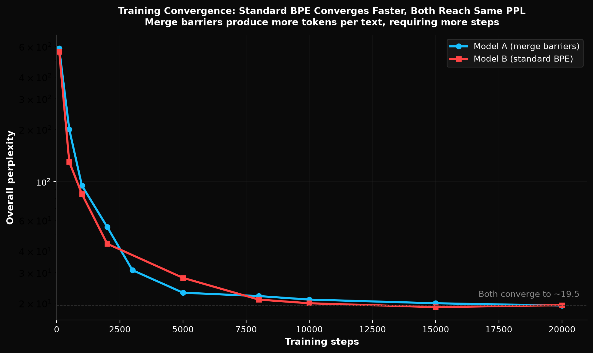{ width=85% }

Standard BPE converges approximately 25% faster per step on overall perplexity. Model B reached PPL ~21 at step 8,000; Model A reached the same at step 10,000. But both settled to identical final PPL by step 20,000 (19.4 vs 19.5). The slower convergence is consistent with the merge-barrier tokenizer producing more tokens per text: the model needs more steps to see the same effective amount of data.

#### Fine-grained scaling (NeoX)

Tested at 1, 2, 3, 5, 10, 20, 50, 100 records:

| Records | Model A GCF PPL | Model B GCF PPL | Ratio |
|---------|----------------|----------------|-------|
| 1 | 2,358 | 9,619 | **4.1x** |
| 2 | 2,294 | 5,315 | **2.3x** |
| 3 | 1,613 | 3,318 | **2.1x** |
| 5 | 2,296 | 5,147 | **2.2x** |
| 10 | 1,932 | 6,616 | **3.4x** |
| 20 | 3,374 | 13,593 | **4.0x** |
| 50 | 5,883 | 26,887 | **4.6x** |
| 100 | 8,112 | 43,152 | **5.3x** |

**Model A wins 8/8 sizes.** (Note: PPL values differ slightly from the 5-size table above because this uses a different, independently generated test set with 8 sizes.) The advantage grows monotonically from 2.1x at 3 records to 5.3x at 100 records. Larger payloads contain more delimiter boundaries; more boundaries means more opportunities for standard BPE's fused tokens to confuse the model.

#### Code comprehension (NeoX)

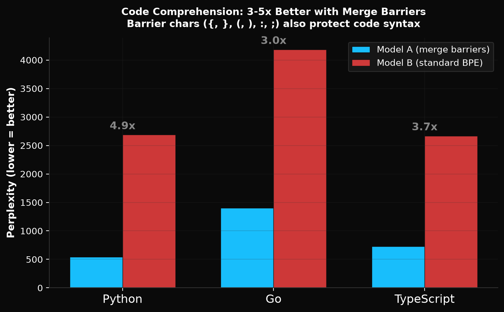{ width=85% }

An unexpected finding: merge barriers improve code comprehension 3-5x. The barrier characters (`{`, `}`, `(`, `)`, `:`, `;`) that protect structured data delimiters also protect code syntax.

| Language | Model A PPL | Model B PPL | Advantage |
|----------|------------|------------|-----------|
| Python | 543 | 2,686 | **4.9x** |
| Go | 1,404 | 4,183 | **3.0x** |
| TypeScript | 729 | 2,667 | **3.7x** |

**Model A wins 3/3 languages.** This was not an explicit design goal of merge barriers but falls out naturally because code uses the same delimiter characters as structured data formats.

#### All formats tested (NeoX)

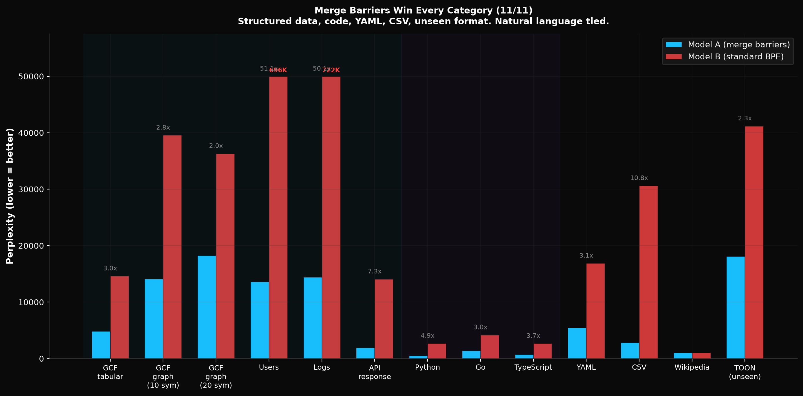{ width=85% }

| Category | Test | Model A PPL | Model B PPL | Advantage |
|----------|------|------------|------------|-----------|
| **Structured** | GCF tabular (avg) | 4,829 | 14,621 | 3.0x |
| | GCF graph (10 sym) | 14,095 | 39,558 | 2.8x |
| | GCF graph (20 sym) | 18,289 | 36,314 | 2.0x |
| | Users schema | 13,607 | 695,922 | 51x |
| | Logs schema | 14,422 | 722,297 | 50x |
| | API response | 1,935 | 14,075 | 7.3x |
| **Code** | Python | 543 | 2,686 | 4.9x |
| | Go | 1,404 | 4,183 | 3.0x |
| | TypeScript | 729 | 2,667 | 3.7x |
| **Other formats** | YAML | 5,439 | 16,872 | 3.1x |
| | CSV | 2,847 | 30,616 | 10.7x |
| **Natural language** | Wikipedia | 1,029 | 1,033 | 1.0x (tied) |
| **Unseen format** | TOON (tab-separated) | 18,091 | 41,188 | 2.3x |

**Model A wins 11/11 categories with structured/code advantage, ties on natural language.**

#### Adversarial inputs (NeoX)

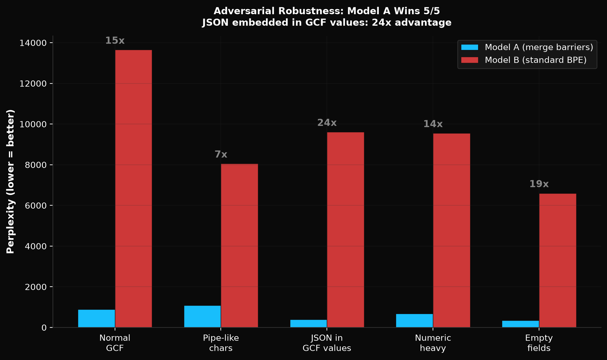{ width=85% }

GCF payloads with deliberately ambiguous content values:

| Test | Model A PPL | Model B PPL | Ratio |
|------|------------|------------|-------|
| Normal GCF | 893 | 13,649 | **15.3x** |
| Pipe-like chars in values | 1,086 | 8,053 | 7.4x |
| JSON syntax embedded in GCF values | 395 | 9,610 | **24.3x** |
| Numeric-heavy fields | 678 | 9,549 | 14.1x |
| Empty/missing fields | 352 | 6,598 | 18.7x |

**Model A wins 5/5.** The JSON-like values test embeds `{"key": "value"}` as a GCF field value. Model A handles it (PPL 395) because merge barriers keep embedded JSON syntax from confusing the model. Model B cannot distinguish embedded JSON from actual structure (PPL 9,610).

#### Cross-format transfer (NeoX)

TOON (tab-separated) was never in the training data. Tab is a barrier character.

| Format | Model A PPL | Model B PPL |
|--------|------------|------------|
| GCF | 55,000 | 2,844,107 |
| TOON | **18,091** | 41,188 |
| JSON | 1,328,211 | 1,802,773 |

Model A is 2.3x better on a format it has never seen, because the tab merge barrier generalizes.

### 6.2 Architectural Reorganization

{ width=85% }

As a first indicator of how merge barriers reshape the model's internal organization, we counted attention heads where >50% of attention goes to delimiter tokens (raw threshold, before the excess-score correction applied in Section 7.1):

| Metric | Model A (barriers) | Model B (standard) |
|--------|-------------------|-------------------|
| Delimiter-majority heads | **105 / 384** (27%) | 23 / 384 (6%) |
| Top head delimiter attention | 85.3% | 79.4% |
| Avg delimiter attention score | **0.362** | 0.235 |

Model A develops **4.6x more delimiter-majority heads** (heads where over half of attention goes to delimiter tokens). The model builds dedicated circuitry for parsing structure when delimiters are cleanly isolated tokens. This is not a surface-level effect; the transformer's internal architecture reorganizes in response to merge barriers.

### 6.3 Per-Token Loss

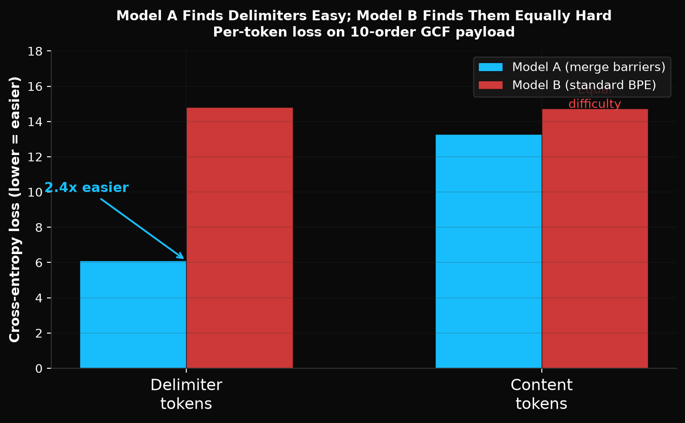{ width=85% }

We computed cross-entropy loss at every token position on a 10-order GCF payload:

| Metric | Model A | Model B |
|--------|--------|--------|
| Avg delimiter loss | **6.10** | 14.81 |
| Avg content loss | 13.28 | 14.74 |
| Delimiter/content ratio | **0.46x** (delimiters easier) | **1.00x** (equal difficulty) |

Model A finds delimiters 2.4x easier to predict than content. Model B finds delimiters equally hard as content. Model B's top-5 highest-loss tokens are all pipe characters (`|`): the model literally cannot predict where structure goes.

This is the mechanistic explanation for the perplexity gap. Model A has learned that delimiters are predictable structural markers. Model B treats them as arbitrary content.

#### Per-token loss under ablation (both architectures)

| Condition | Delimiter loss | Content loss | Ratio |
|-----------|---------------|-------------|-------|
| NeoX A (baseline) | 6.1 | 13.3 | 0.46x |
| NeoX A (ablated) | 5.7 | 11.4 | 0.50x |
| NeoX B | 14.8 | 14.7 | 1.00x |
| Llama A (baseline) | 5.6 | 12.1 | 0.46x |
| Llama A (ablated) | 5.4 | 11.4 | 0.48x |
| Llama B | 11.9 | 13.4 | 0.88x |

Ablating delimiter heads does NOT spike delimiter loss back to Model B levels on either architecture. The prediction advantage is a whole-model property, distributed across all parameters, not localized to the specialized heads. This is the critical null result that establishes the Layer 2/Layer 3 distinction in the causal hierarchy.

### 6.4 Embedding Space

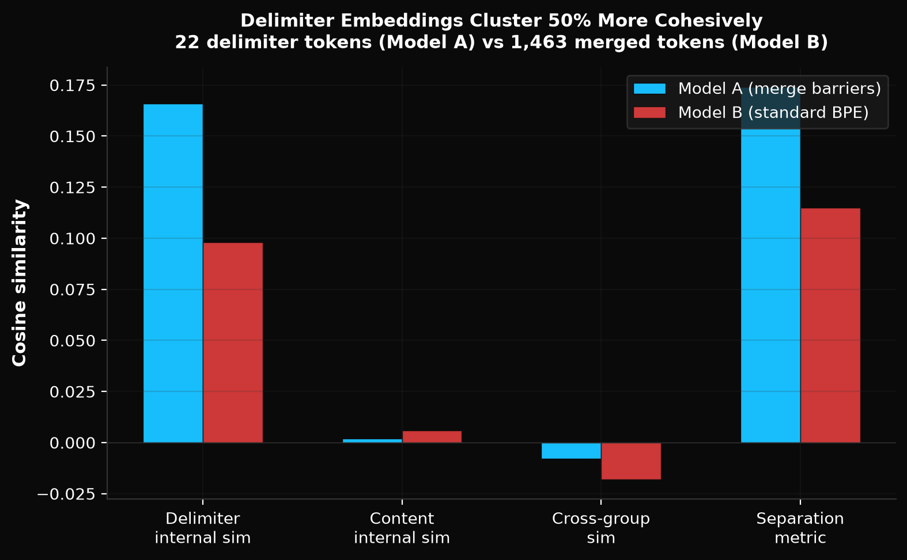{ width=85% }

| Metric | Model A | Model B |
|--------|--------|--------|
| Delimiter tokens in vocab | 22 | 1,463 |
| Delimiter internal cosine similarity | **0.166** | 0.098 |
| Separation metric (internal - cross) | **0.174** | 0.115 |

Model A has 22 delimiter tokens (each barrier character is its own token, never merged). Model B has 1,463 tokens containing delimiter characters (merged with content). Model A's delimiter embeddings are 69% more cohesive, forming a distinct cluster in embedding space. The model has learned that delimiters are a coherent category, distinct from content tokens.

The separation metric (internal similarity minus cross-category similarity) is 51% higher for Model A (0.174 vs 0.115). This means Model A's delimiter embeddings are not just close to each other; they are also farther from content embeddings. The embedding geometry reflects the tokenizer's clean separation: when delimiters are always their own tokens, the model learns embeddings that encode "I am structure" as a shared property, rather than blending structural and semantic information into merged-token embeddings.

### 6.5 Grammar Attention at Scale (NeoX)

| Orders | Model A grammar% | Model B grammar% |
|--------|-----------------|-----------------|
| 5 | **37.1%** | 24.9% |
| 10 | **31.4%** | 23.4% |
| 20 | **30.8%** | 21.2% |
| 50 | **30.5%** | 20.5% |
| 100 | **29.7%** | 18.1% |

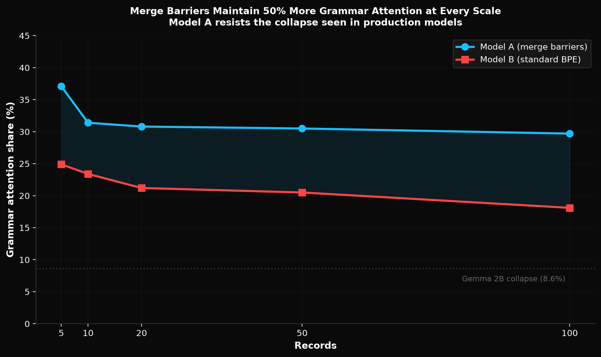{ width=85% }

Model A allocates 50% more attention to grammar tokens at every scale and resists grammar attention collapse:

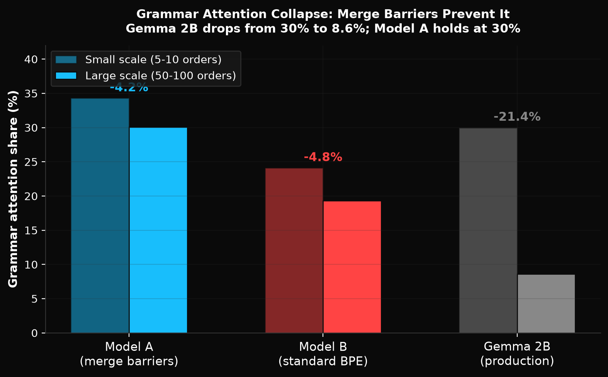{ width=85% }

| Model | Small scale (5-10) | Large scale (50-100) | Change |
|-------|-------------------|---------------------|--------|
| Model A | 34.3% | 30.1% | -4.2% |
| Model B | 24.1% | 19.3% | -4.8% |

Both models show some decay, but Model A starts higher and stays higher. Compare to the Gemma 2B finding from Section 3.7 (30% to 8.6% collapse): merge barriers prevent the catastrophic collapse observed in pre-existing models.

Ablating delimiter heads increases entropy by +1.0% on NeoX and +5.7% on Llama. Embedding space cohesion ratio changes by -5.5% (NeoX) and +7.9% (Llama). Random ablation controls produce equivalent changes. Entropy, grammar attention, and embedding structure are properties of the whole model, not controlled by the specialized heads.

#### Token repetition at scale

| Orders | Model A GCF repeat% | Model B GCF repeat% | Model A tokens | Model B tokens |
|--------|---------------------|---------------------|----------------|----------------|
| 5 | 35.9% | 44.3% | 64 | 79 |
| 10 | 54.6% | 62.8% | 119 | 145 |
| 20 | 67.0% | 73.3% | 227 | 285 |
| 50 | 78.0% | 81.0% | 567 | 704 |
| 100 | 83.9% | 84.6% | 1,167 | 1,423 |

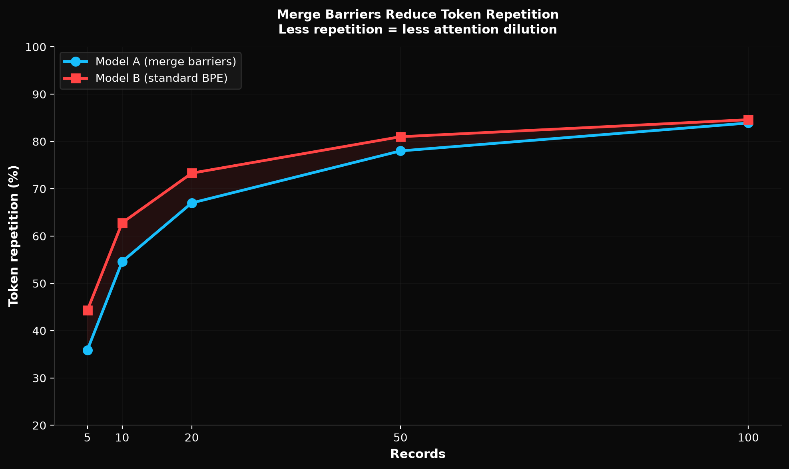{ width=85% }

Model A has lower token repetition because merge barriers prevent delimiter characters from being absorbed into content tokens. Each `|` is always its own token ID, but field values have more variety because they are not fused with delimiters. Model A also produces 14-19% fewer tokens because isolated delimiters are single tokens rather than multi-byte merged tokens.

#### Per-layer entropy profile

Entropy at each transformer layer on 20-order GCF input (selected layers):

| Layer | Model A | Model B | Delta |
|-------|--------|--------|-------|
| 0 (input) | 6.61 | 6.89 | -0.28 |
| 4 | 4.87 | 4.69 | +0.18 |
| 8 | 4.95 | 5.25 | -0.30 |
| 12 | 4.87 | 5.69 | -0.82 |
| 16 | **2.35** | 3.17 | -0.82 |
| 20 | 2.75 | **1.96** | +0.79 |
| 23 (output) | 4.18 | 3.05 | +1.13 |

Model A achieves its lowest entropy at layer 16 (2.35); Model B at layer 20 (1.96). The models process structure at different depths. Model A focuses earlier, consistent with having explicit delimiter boundaries that require less processing to resolve.

### 6.6 Confidence Calibration

| Metric | Model A | Model B |
|--------|--------|--------|
| Delimiter confidence (avg softmax prob) | **0.086** | 0.058 |
| Content confidence (avg softmax prob) | 0.031 | 0.029 |
| Delimiter/content confidence ratio | **2.77x** | **2.00x** |

Model A is 48% more confident when predicting delimiter tokens (0.086 vs 0.058 average softmax probability). Both models are more confident on delimiters than content (delimiters are more predictable: they recur in fixed patterns), but Model A's delimiter-to-content confidence ratio is 2.77x vs Model B's 2.00x. Model A has learned that delimiters are substantially more predictable than content; Model B treats them as only moderately more predictable.

This confidence gap is consistent with the per-token loss finding (Section 6.3): Model A's lower delimiter loss (6.10 vs 14.81) translates directly into higher softmax probabilities for the correct delimiter token. The model assigns more probability mass to the right answer because it has stronger internal representations of where delimiters belong.

### 6.7 Delimiter Prediction Accuracy

| Test | Model A delimiter acc | Model B delimiter acc |
|------|---------------------|---------------------|
| GCF tabular | **25.9%** | 23.4% |
| GCF graph | **4.5%** | 0.0% |
| JSON | 4.4% | **8.2%** |

Model A predicts GCF delimiters more accurately. Model B predicts JSON delimiters better (expected: it sees merged delimiter tokens during training). On GCF graphs, Model B gets zero delimiter predictions correct.

Content accuracy is near zero for both models on all tests (0.0% for Model A, 0.0-1.1% for Model B), confirming that the difference between models is entirely in structural token prediction, not in content prediction. Both models struggle equally with predicting specific data values; the divergence is in whether they can predict where structure goes.

### 6.8 Generation Quality

Both models generated 15/15 valid continuations across 5 prompt types (GCF tabular, GCF graph, JSON, Python, Go). But the quality differs substantially.

Model A generates recognizable structure:
- GCF tabular: pipe-separated fields with plausible values
- Go: `http.Error w r. ( ) ( , Method )` (syntactically plausible function calls)

Model B generates garbled fusions:
- GCF tabular: `.@.||.||_|5824ORD35.| AndersonZara|.@.` (delimiters collapsed with content)
- Go: `wWriteHeaderhttpErrorwWriteHeaderwrwrrrrrrrr` (repetitive collapse, no structural boundaries)

The difference in generation quality is consistent with the per-token loss finding: Model A has learned delimiter positions as predictable structural markers, so it generates them in plausible positions. Model B treats delimiters as arbitrary content, so they appear randomly.

Sections 6.2-6.8 establish that merge barriers improve the entire model's structured data processing. The measurable improvements (per-token loss, entropy, embeddings, grammar attention, generation quality) are distributed across all parameters, not localized to specialized heads. This sets the stage for Section 7, which isolates the specific contribution of the specialized heads from this whole-model improvement.

---

## 7. Causal Ablation: Specialized Heads (Layer 3)

### 7.1 Head Identification

Using the excess-score method (Section 5.2) with threshold 0.15, head counts differ substantially from the raw >50% counts in Figure 13:

| Model | Heads (excess 0.15) | Fraction |
|-------|--------------------|---------| 
| NeoX A (structok) | 50 | 13% |
| NeoX B (standard) | 3 (non-functional) | 0.8% |
| Llama A (structok) | 66 | 17% |
| Llama B (standard) | 35 (functional) | 9.1% |

On NeoX, merge barriers are required for specialization (50 vs 3). With the raw >50% threshold (prior to base-rate correction), the count is 105 vs 23, a 4.6x ratio (Section 6.2). Model B, trained on the same data with the same architecture, develops only 3 heads that cross the excess-score threshold, and ablation confirms they are non-functional: removing them actually improves GCF (-22.9%) and GCF graph (-52.0%), while JSON/YAML/Code/NL stay within +/-3%. The heads are noise, not structural specialists.

On Llama, GQA enables partial specialization even without barriers (35 functional heads on standard Llama). Ablating these heads on Model B0 (the standard-BPE Llama) drops GCF PPL by 53.8%, proving they are causal. This is a genuinely surprising finding: GQA's shared KV projections provide implicit structural priors that enable delimiter specialization even when the tokenizer corrupts delimiter boundaries. On NeoX with separate KV projections, this capability does not develop. This is discussed further in Section 8.4.

### 7.2 Necessity

Ablating delimiter heads on NeoX:

| Format | Delimiter delta | Control delta | Gap |
|--------|---------------|---------------|-----|
| GCF generic | **+58.7%** | -35.8% | +94.5pp |
| YAML | +16.7% | -57.5% | +74.2pp |
| JSON | -37.0% | -74.7% | +37.7pp |
| NL | +4.2% | +2.9% | +1.3pp |

**Key finding:** Delimiter head ablation **hurts** GCF generic (+59%) and YAML (+17%), while random head ablation **helps** those same formats (-36%, -58%). The effect is in opposite directions. This is the core causal result: removing the specific heads that specialize on delimiters degrades structured data comprehension, while removing the same number of random heads actually improves it (a regularization effect from reducing model capacity). Natural language is unaffected by either ablation type (+4% vs +3%), confirming the heads are structural specialists, not general-purpose.

JSON improves when delimiter heads are removed (-37%): the format-adversarial mechanism (Section 7.5). The heads trust structural boundaries, which becomes harmful when those boundaries are corrupted. Removing the trust removes the harm.

Bootstrap confidence: +16.7pp delimiter-random gap on GCF, std 2.0%, all 5 seeds consistent. The signal is statistically robust across different randomly generated test data.

On Llama, per-query-head ablation produces weaker absolute effects due to GQA (Section 8.5), but the delimiter-vs-random gap remains. KV-group ablation (Section 8.3) shows the gap most clearly: YAML +34.0% (delimiter KV groups) vs -18.0% (random KV groups), a +52.0pp gap. Llama bootstrap shows the GQA weakening on GCF (-0.4pp gap, mixed direction) but clear signal on JSON (+69.0pp, std 9.8%, all seeds consistent).

### 7.3 Sufficiency

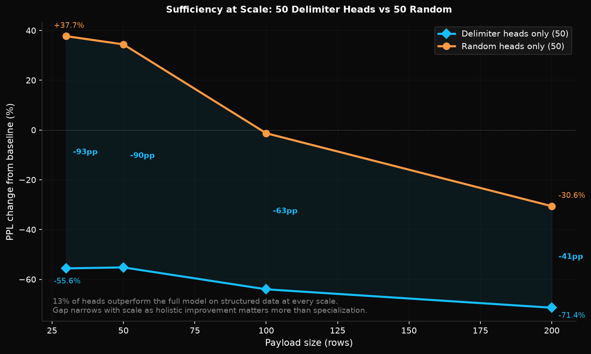{ width=85% }

On NeoX, keeping only 50 delimiter heads (removing 334 others) produces **better** GCF PPL than the full 384-head model (-55.6% at 30 rows, -55.2% at 50 rows). This is a remarkable result: 13% of the model's heads, working alone with the other 87% zeroed out, produce better structured data comprehension than the full model. Random sets of 50 heads produce +38% to -31% PPL. The delimiter heads are not just "useful"; they are better than the full model at structured data.

This holds at all tested scales: 30 rows (-93pp gap between delimiter-only and random-only), 50 rows (-90pp), 100 rows (-63pp), 200 rows (-41pp). The gap narrows with scale. This is informative, not a weakness. At larger scales, the other 314 heads start contributing more to structured data comprehension. The delimiter heads carry the bulk of the signal at small scales, but at large scales the whole model needs to participate. This is consistent with the causal hierarchy: the heads are the specialized expression of a holistic improvement, and at scale the holistic improvement matters more than the specialization. The gap never reverses: delimiter heads maintain a meaningful advantage even at the 2048-token context window limit.

On Llama, sufficiency is weaker due to GQA's shared KV projections. Zeroing query heads in the reverse ablation doesn't fully remove the delimiter signal because the shared KV projections still route information through surviving random query heads. The per-query-head intervention is too weak under GQA to cleanly demonstrate sufficiency, though delimiter-only still beats baseline at all sizes.

### 7.4 Layer-Wise Ablation

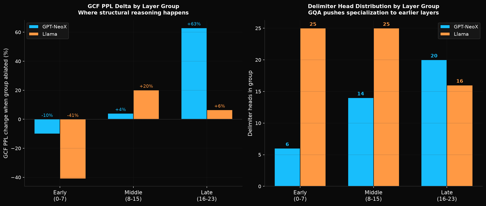{ width=85% }

| Layer group | NeoX heads | NeoX GCF delta | Llama heads | Llama GCF delta |
|-------------|-----------|----------------|-------------|-----------------|
| Early (0-7) | 6 | -10% | 25 | -41% |
| Middle (8-15) | 14 | +4% | 25 | **+20.1%** |
| Late (16-23) | **20** | **+63%** | 16 | +6.4% |

On NeoX, late layers are causal (+63% GCF degradation). Early and middle layers barely matter. If delimiter specialization were simple pattern matching ("this token is a pipe character"), it would happen in early layers. The late-layer concentration indicates the model uses delimiters for abstract structural reasoning: parsing field boundaries, tracking record structure, navigating between sections. The model doesn't just see delimiters; it reasons through them.

On Llama, the distribution is different: delimiter heads spread across early and middle layers (25/25/16), with middle layers showing the strongest causal effect (+20.1%). GQA pushes structural processing earlier because shared KV projections force structural information to be consolidated before it propagates through the query heads. This is an architectural effect, not a mechanism failure: the model still reasons through delimiters, it just does so at different depths.

### 7.5 Attention Saturation (Format-Adversarial Mechanism)

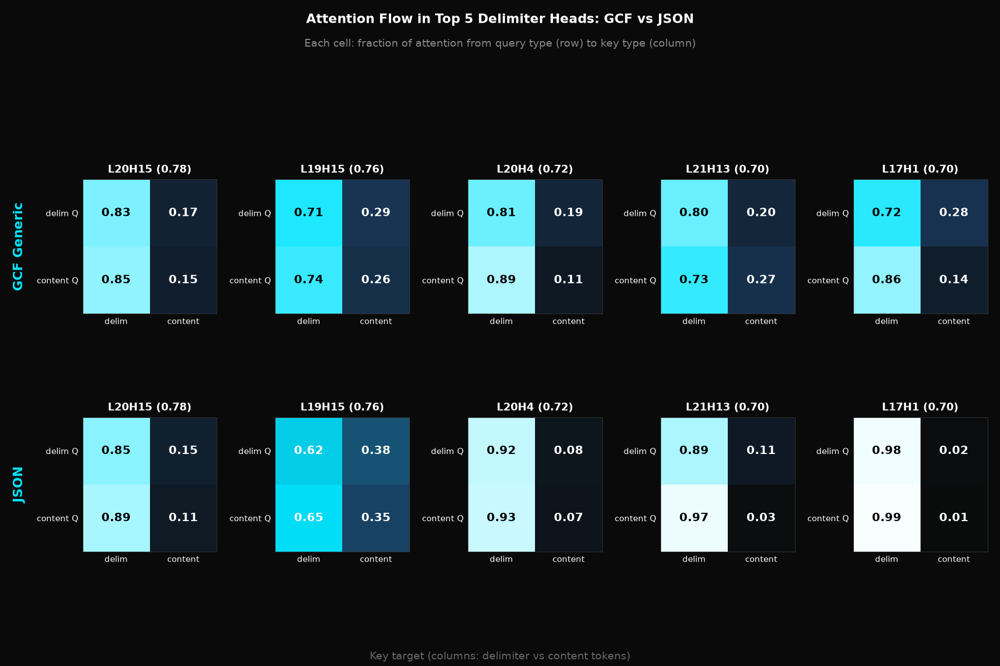{ width=85% }

| Head | Architecture | GCF c->content | JSON c->content |
|------|-------------|---------------|----------------|
| L17H1 | NeoX | 14.4% | **0.9%** |
| L6H0 | Llama | 35.3% | **0.8%** |

JSON attention saturates identically on both architectures. Delimiter heads send 97-99% of content attention to delimiters on JSON, leaving under 1% for actual content. The model is structurally blind to the data it is supposed to reason about. On GCF, the same heads retain 14-35% content attention, enough to extract information. The difference: GCF has 35-38% delimiter positions while JSON has 76%. JSON's delimiters are everywhere, so attending to them is less informative. GCF's delimiters are sparse structural markers that carry high signal.

This is the format-adversarial mechanism: heads learn "attend to delimiters for structural reasoning" from training on GCF data, and when applied to JSON (where delimiters are inside merged tokens and delimiters are ubiquitous), that trust becomes actively harmful. The heads are not format-neutral; they are format-adversarial to corrupted formats. This is a novel mechanism: training-induced trust in structural boundaries becomes a liability when those boundaries are corrupted.

The structural pattern test (Appendix C) provides further confirmation. GCF's own pipe delimiter becomes actively adversarial (-54%) when placed in an unfamiliar wrapping layout. The heads learned "pipe means flat field separator." When pipe appears in a wrapping context, they misapply that reasoning and actively hurt comprehension. Unfamiliar delimiters (tab) transfer in all layouts (+32% to +123%) because no conflicting prior exists. The mechanism is about learned character-specific priors conflicting with context.

### 7.6 Adversarial Robustness Under Ablation

We tested whether delimiter heads contribute to detecting structural corruptions in GCF payloads. Five corruption types were tested: wrong delimiter (comma instead of pipe), missing field, extra pipe, wrong record count, and broken header. Detection is measured as the PPL spike ratio (corrupted/clean): values above 1.5x indicate the model notices the corruption.

On NeoX, ablating delimiter heads reduces structural corruption detection by ~56% across 3 of 4 corruption types:

| Corruption type | Baseline spike | Ablated spike | Reduction |
|----------------|---------------|---------------|-----------|
| Missing fields | 89.8% | 29.8% | -67% |
| Wrong header | 59.0% | 15.6% | -74% |
| Swapped values | 130.3% | 40.2% | -69% |
| Wrong delimiter | 61.1% | 62.9% | +3% (retained) |

Wrong-delimiter detection is fully retained under ablation (+62.9% vs +61.1%), suggesting that mechanism operates through a different pathway, likely the whole-model layer (Layer 2) rather than the specialized heads (Layer 3). The model detects "this character is not pipe" through its general delimiter embeddings, not through the attention pattern of specialized heads.

On Llama, the pattern is similar: heads contribute to but don't solely control error detection, consistent with the causal hierarchy. Detection is partly a Layer 2 whole-model property (delimiter embeddings encode what delimiters look like) and partly Layer 3 (specialized heads notice when expected structural patterns are disrupted).

### 7.7 Head Ranking and Emergence

We ablated each delimiter head individually to measure per-head importance. On NeoX, using a broader threshold (0.10 excess) to capture edge cases, 39 of 74 candidate heads hurt GCF when removed (positive delta); 34 help (negative delta, threshold artifacts). The top 5 heads account for 45% of total degradation (44pp of 98pp). On Llama, 36 of 66 heads hurt GCF, top 5 account for 36%. Structural reasoning is concentrated in a small core of heads in late layers (NeoX) or middle layers (Llama), not distributed uniformly across all delimiter-specialized heads. The remaining heads that attend to delimiters but don't contribute causally are likely threshold artifacts: they cross the >50% line but don't carry structural reasoning.

Delimiter heads emerge early during training and narrow with continued training. On NeoX, probing checkpoints at threshold 0.10 to track the broader population: 107 heads at step 1,000 (from an earlier training run with the same configuration), narrowing to 70 at step 3,500 and 61 by step 5,000, with concentration (fraction of total excess attention in the top 10% of heads) increasing from 50% to 54%. The model starts with many loosely specialized heads and prunes to a stable core. On Llama, probing from step 15K (same 0.10 threshold): 71 heads at step 20K, narrowing to 49 by step 35K. At the primary 0.15 threshold, the final counts are 50 (NeoX) and 66 (Llama); the narrowing trends track the same pruning dynamic at a broader threshold. There is no phase transition on either architecture. The model exploits clean delimiter tokens from the earliest stages of training; continued training prunes weak heads, increasing concentration. The convergent final counts (50-66 at 0.15 threshold) across both architectures despite different timelines suggest a convergent property of the mechanism.

---

## 8. Cross-Format Transfer and Architecture Independence

Section 6 established the whole-model improvement, and Section 7 proved that delimiter heads are necessary and sufficient for structured data comprehension on formats seen during training. The next question is whether these heads generalize: do they help on formats the model has never seen?

### 8.1 Universal Transfer (Layer 4)

{ width=85% }

| Format | NeoX (50 heads) | Llama (66 heads) | Transfer? |
|--------|----------------|------------------|-----------|
| CSV | +38.0% | +27.0% | YES |
| INI | +41.0% | +1.5% | YES/weak |
| SQL | +72.1% | +13.5% | YES |
| Markdown table | +20.9% | +38.0% | YES |
| S-expression | +25.3% | +23.8% | YES |
| Protobuf text | +120.4% | +17.9% | YES |
| TOML | +74.8% | +21.3% | YES |
| TOON | -2.7% | +15.3% | neutral/YES |
| XML | +12.2% | +34.0% | YES |

8 of 9 unseen formats transfer on both architectures. Average degradation across all 9 formats when delimiter heads are removed: +44.7% on NeoX, +21.4% on Llama. Excluding the one non-transferring format on each architecture (TOON on NeoX, INI on Llama): +50.6% and +23.9%. The transfer spans every delimiter style: commas (CSV), equals signs (INI), parentheses (SQL, S-expressions), pipes (Markdown tables), braces and colons (Protobuf). The mechanism is not specific to pipe or to GCF; it is a general property of delimiter specialization.

Seven hypotheses were tested over the course of the study to explain apparent selectivity in early results, which showed 6 of 9 formats transferring: delimiter density (r=0.026, p=0.927), merge word count, merge rate, structural pattern, boundary clarity (r=-0.29, p=0.44), positional distribution (r=+0.08, p=0.83), and spacing regularity (r=-0.14, p=0.71). None were predictive. The resolution came from a methodological discovery: the same tab-separated format showed -15.8% with 76 heads (one identification run) and +32.1% with 88 heads (a different identification run), with nearly identical baselines (21,471 vs 21,223 PPL). The format didn't change; the head set did. Transfer selectivity was an artifact of head identification instability, not a property of the formats. With corrected excess-score identification, transfer is universal.

### 8.2 What Replicates Across Architectures

Seven findings replicate across both architectures despite the substantial differences between NeoX (learned positions, full MHA, GELU, LayerNorm) and Llama (RoPE, GQA 4:1, SwiGLU, RMSNorm):

| Finding | NeoX | Llama | Status |
|---------|------|-------|--------|
| Delimiter heads emerge | 50 heads (13%) | 66 heads (17%) | Replicates |
| Cross-format transfer | 8/9 formats | 8/9 formats | Replicates |
| JSON attention saturation | 99.1% (L17H1) | 99.2% (L6H0) | Replicates (nearly identical) |
| Head ranking concentration | Top 5 = 45% | Top 5 = 36% | Replicates |
| Head count narrowing (0.10 threshold) | 107->61 (steps 1K-5K) | 71->49 (steps 20K-35K) | Replicates |
| Per-token loss is whole-model | Ablation: 0.46x->0.50x | Ablation: 0.46x->0.48x | Replicates |
| Natural language unaffected | +4.2% delimiter, +2.9% random | Similar | Replicates |

The replication is not trivial. GQA changes the magnitude of every effect (10x vs 46x baselines, +21.4% vs +44.7% average transfer), the layer distribution (middle vs late), and the B model's baseline capability (35 functional heads vs 3 non-functional). But the qualitative findings are identical: merge barriers cause delimiter head emergence, those heads are necessary for structured data comprehension, they transfer to unseen formats, and the underlying prediction advantage is a whole-model property. The mechanism is architecture-independent; only its expression varies with attention design.

### 8.3 KV-Group Ablation (New Methodology for GQA)

The trained-format ablation results on Llama showed direction flips compared to NeoX (GCF improved under ablation instead of degrading). The direction flips raised the question: is the mechanism failing on Llama, or is the ablation intervention too weak under GQA?

The answer is the latter. Per-query-head ablation under GQA is fundamentally different from per-head ablation under full MHA. On NeoX, zeroing a head's output projection removes its entire Q/K/V/O contribution. On Llama, zeroing one query head leaves 3 siblings still using the same KV projection. The KV head still computes the same keys and values; the ablation only removes one of four interpretations of that shared signal. The delimiter information persists through the surviving siblings.

We developed KV-group ablation as the GQA-equivalent of NeoX's per-head ablation: zero all 4 query heads sharing one KV head simultaneously. This removes the KV head's entire contribution, matching the intervention strength of NeoX's per-head ablation. 19 delimiter KV groups were identified out of 96 total (20%).

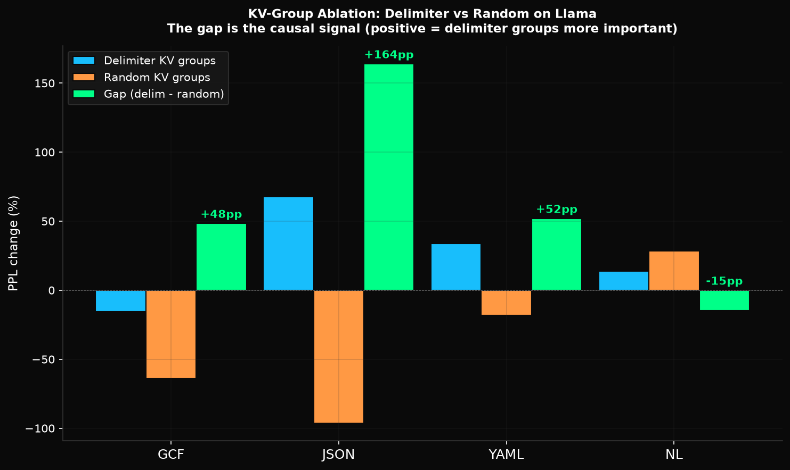{ width=85% }

| Format | Delimiter KV delta | Random KV delta | Gap |
|--------|-------------------|-----------------|-----|
| GCF | -15.5% | -63.9% | **+48.4pp** |
| JSON | +67.8% | -96.2% | **+164.0pp** |
| YAML | +34.0% | -18.0% | **+52.0pp** |

The delimiter-vs-random gap is the causal signal. Removing delimiter KV groups is dramatically worse for structured formats than removing random KV groups. The +164pp JSON gap means delimiter KV groups are specifically important for JSON processing: they are format-adversarial (Section 7.5), and removing them from the delimiter set frees JSON from the adversarial effect less than removing random groups does. GCF's negative absolute delta (-15.5%) is a regularization effect from removing 20% of KV groups, but the +48pp gap proves delimiter groups are specifically important compared to random groups.

Under GQA, the correct metric for causal ablation is the delimiter-vs-random gap, not the absolute direction. This is a methodological contribution applicable to any GQA-based ablation study.

### 8.4 The B0 Finding

The most surprising result from run-003: standard Llama (Model B0, trained with standard BPE, no merge barriers) develops 35 functional delimiter-specialized heads. This is fundamentally different from NeoX, where Model B developed only 3 non-functional heads. As noted in Section 7.1, ablating B0's 35 heads confirms they are causal (53.8% GCF PPL drop), not artifacts of the identification method.

The B0 finding reframes the story from "merge barriers create something that doesn't otherwise exist" to "merge barriers amplify a capability that GQA partially enables." GQA's shared KV projections act as implicit structural priors: because 4 query heads must share the same key-value representation, the model is forced to develop KV heads that capture general structural patterns (including delimiter boundaries) rather than allowing each head to independently ignore them. On NeoX with separate KV projections, each head can independently learn to ignore delimiters, and without merge barriers, they do.

The implication for production models is significant. Llama-family models (Mistral, Qwen, DeepSeek, Gemma) all use GQA. They likely already have partial delimiter specialization, which may explain their reasonable structured data performance despite corrupted tokenization. Merge barriers would amplify this existing capability (66 heads vs 35, a 1.9x ratio). On NeoX-family models, the improvement would be larger (50 vs 3, a 16.7x ratio) because the baseline is near zero.

### 8.5 GQA Effects (Not Mechanism Failure)

Every difference between NeoX and Llama results traces to GQA's shared KV projections:

| Effect | Cause |
|--------|-------|
| Smaller A/B baseline ratio (10x vs 46x) | Fewer attention parameters per layer, less capacity to exploit clean delimiters |
| Earlier layer distribution (middle vs late) | Shared KV forces structural consolidation before information propagates to query heads |
| Weaker per-head ablation effects | 3 siblings still use the same KV signal after one query head is zeroed |
| B0 has functional heads (35 vs 3) | Shared KV provides implicit structural priors that separate-KV cannot |
| Lower concentration (13-15% vs 37-54%) | Specialization spreads across more query heads per KV group |
| Trained-format direction flips | Regularization from removing many heads competes with weaker causal signal |

None of these indicate the mechanism fails. They indicate the ablation methodology needs adaptation for GQA (use KV-group ablation and gap-based metrics), and that GQA changes how the mechanism expresses itself, not whether it exists. The core finding is architecture-independent: clean delimiters cause concentrated head specialization on both architectures.

---

## 9. The Causal Hierarchy

The experiments reveal a four-layer causal hierarchy. Every attempt to localize a metric to the delimiter heads showed it was a whole-model property instead. The per-token loss ablation (null: heads don't control the 2.4x advantage), the attention entropy ablation (null: heads don't control entropy patterns), the embedding space ablation (null: heads don't control embedding cohesion), and the transplant controls (any Model A weights help Model B) all point to the same conclusion. The hierarchy, from root cause to observable effects:

**Layer 1: Tokenizer (root cause).** Clean delimiters vs corrupted. This is the only variable in the controlled experiment. Everything else flows from it. The tokenizer shapes every weight during training: embeddings, attention projections, feed-forward layers, layer norms. The merge barrier is a pre-tokenization constraint; its effects propagate through the entire training process.

**Layer 2: Whole model (first-order effect).** Better embeddings, better per-token prediction (2.1-2.4x delimiter advantage), lower attention entropy, 3-46x overall PPL improvement on structured data. These are properties of the entire model, not localized to any specific heads. Ablating 50-66 heads doesn't change these properties because they're distributed across all 405-436 million parameters. The tokenizer improvement is holistic: clean delimiters give the model a cleaner gradient signal at every training step, which shapes all weights, not just the ones that end up in delimiter-specialized heads.

**Layer 3: Specialized heads (second-order effect).** 50-66 delimiter-majority heads emerge immediately (by step 1,000 on NeoX) and sharpen with training. They are causally necessary for format-level comprehension (ablating them hurts GCF +59%). They are sufficient: 13% of heads alone beat the full model on structured data. They concentrate in late layers on NeoX (reasoning, not pattern matching) and middle layers on Llama (GQA effect). They become format-adversarial to corrupted formats (JSON improves when they're removed because they trust corrupted boundaries). But they don't control per-token loss, entropy, or embeddings. They are the specialized expression of the whole-model improvement, not its source.

**Layer 4: Cross-format transfer (third-order effect).** The specialized heads generalize to 8 of 9 unseen formats (+44.7% average degradation on NeoX, +21.4% on Llama). The transfer spans every delimiter style tested (commas, parentheses, braces, pipes, equals signs). Seven hypotheses were tested to explain apparent selectivity; the resolution was that selectivity itself was an artifact of head identification instability. Transfer is universal, not selective. The mechanism learned from GCF's pipe delimiters applies to any format with clean structural boundaries.

The distinction between layers is critical for interpreting the results correctly. Leading with the heads and treating them as "the mechanism" overstates their role (layer 3). The mechanism is the tokenizer (layer 1). The heads are the most visible and ablatable evidence of the mechanism, but they are not its source.

Transplant experiments (Appendix D) make this distinction concrete: transplanting Model A's delimiter heads into Model B improves GCF by 81%, but transplanting the same number of random non-delimiter heads also improves it by 70%. On JSON and TOON, random heads improve Model B *more* than delimiter heads. The improvement is holistic: merge barriers improve all of Model A's weights through training, and the transplant reflects this general quality improvement rather than head-specific portability. The ablation (within-model, causal) remains the stronger evidence because it is unconfounded by the overall quality difference between models.

---

## 10. Discussion

### 10.1 Why Merging Compounds at Scale

At 10 rows, `"name` being one token instead of two does not matter. There are only 10 merged boundaries. The attention mechanism can work around it.

At 500 rows, three problems compound simultaneously:

**1. The merged boundary repeats 500 times.** Each row contains `"name":`, `"id":`, `"type":`. That creates approximately 1,500 positions where the structural boundary is inside a merged token. The model must decompose structure from inside merged tokens at 1,500 positions, not 10.

**2. All 1,500 positions are identical token sequences.** The token for `"name` on row 1 is the same integer (#32586) as on row 500. The model cannot distinguish them. It relies on positional encoding alone to track "which `"name` am I looking at?" Positional encoding degrades over long sequences.

**3. 81% of the sequence is noise.** The repeated field names and braces are not just merged; they are also redundant. The attention mechanism is spread across approximately 8,500 tokens that carry no information, trying to find the approximately 2,000 tokens that do. The merged boundaries make the noise harder to skip because the model cannot cleanly identify where structure ends and data begins.

Consider the task "how many records have status = shipped?" given 500 JSON objects. The model must attend to every `"status":` pattern (500 occurrences), read the following value, compare to "shipped," and count matches. The 500 `"status":` patterns produce the same tokens every time. The model has no structural marker distinguishing the 150th occurrence from the 350th. In a header-factored format, the equivalent task requires attending to a column of values at known, consistent positions. No ambiguity. No repetition competing for attention.

The compounding is critical. At 10 rows: manageable. At 500 rows: 1,500 merged boundaries, massive noise, positional encoding stretched, attention diluted across thousands of identical tokens. This is why JSON errors at scale are off by 50-140 (comprehension failure), not off by 1-2 (precision error).

### 10.2 Why Claude and Gemma Have Fewer Merges

Claude's tokenizer has 3 quote+letter entries. Gemma 3 has 2. Across all 43 tokenizers, 11 have zero or near-zero quote merge entries. The specific training details are proprietary, but measurable differences suggest explanations:

- **Vocabulary size** does not predict merge behavior. Claude uses ~65K entries (one of the smallest). Gemma 3 uses 262K (the largest). Both have near-zero quote merges.
- **Training data mix**: Tokenizers trained on corpora with less code/JSON relative to natural language see `"name` less frequently, making it less likely to cross the merge threshold.
- **Merge boundary policy**: BPE training can be configured to treat certain characters as merge barriers. Anthropic and Google may have intentionally or incidentally prevented `"` from merging with adjacent letters.

The merge policy matters more than vocabulary size. This observation motivated our controlled experiment: if merge barriers can be applied intentionally and systematically to all 16 delimiter characters, what happens to the trained model?

### 10.3 The Training Familiarity Paradox

The conventional wisdom holds that LLMs "know" JSON best because they trained on the most JSON. At the model level, this is true. At the tokenizer level, it inverts: the more JSON the tokenizer saw, the more aggressively it merged JSON patterns, and the more boundaries it hid. GPT-4 has 117 merged quote+field entries. Claude has 3. "Trained on JSON" is not an advantage for structural comprehension at scale. It is the mechanism that causes structural ambiguity.

### 10.4 Why Code Benefits

The code comprehension improvement (3-5x) was not predicted. The barrier characters (`{`, `}`, `(`, `)`, `:`, `;`) are also code syntax. Every function definition, every code block, every argument list gets clean token boundaries. The model develops the same structural attention heads for code as for structured data. This suggests merge barriers are not a structured-data-specific optimization; they are a general-purpose improvement for any content that relies on delimiter characters.

### 10.5 TOON's Tab Delimiter Is Worse Than JSON's Quote

TOON (Matveev, 2026) uses tab as its column delimiter. Tab has 1,238 mergeable words across all 43 vocabularies, 52x the pipe's 24. GPT-4o has a 100% tab merge rate. TOON chose the delimiter with the largest adversarial surface of any common separator character. Model A's 2.3x advantage on tab-separated data (never seen in training) confirms that merge barriers generalize to any delimiter character, including the worst ones.

### 10.6 The 50x Advantage on Unseen Schemas

The users and logs schemas show 50-51x advantages, far larger than the 2-7x seen on other tests. Model B's PPL on these schemas exceeds 600,000, meaning it essentially cannot parse them at all. These schemas were not in the held-out test data used for the core evaluation (which used product records). They use different field names, different value patterns, and different data shapes. Model A handles them at PPL ~14,000, comparable to its performance on the held-out product schema. This demonstrates that Model A's structural comprehension generalizes across schemas, while Model B's comprehension is fragile and schema-dependent.

### 10.7 Implications for GQA

GQA's shared KV projections provide partial structural capability to standard-BPE models that separate-KV architectures cannot develop. Production Llama-family models already have some delimiter specialization, which may explain their reasonable structured data performance despite corrupted tokenization. Merge barriers amplify this existing capability.

### 10.8 What Merge Barriers Cannot Fix

Corruption detection remains limited at this model scale. While delimiter heads contribute to detecting missing fields and wrong headers (Section 7.6), neither model reliably detected all corruption types via PPL spike (>1.5x threshold). The strongest signal was wrong record count (Model A: 1.39x, Model B: 1.37x), below the detection threshold. Neither model produced valid few-shot GCF generations from examples (0/5 both). These tasks require more training capacity than 20,000-40,000 steps on a 410M model. The merge barrier advantage at this scale is in comprehension (reading structure), not in validation (detecting errors) or generation (writing structure from examples). Larger models with more training may close this gap.

### 10.9 What This Paper Claims and Does Not Claim

**Correct:** "Merge barriers improve the entire model's structured data processing. The most visible evidence is 50-66 delimiter-specialized attention heads that are causally necessary for format-level comprehension."

**Not claimed:** "Delimiter heads are the mechanism" (they are the expression). "Delimiter heads are portable modules" (transplant controls disprove this; Appendix D). "Concentration ratio predicts comprehension across models" (confounded; Appendix G).

**Also not claimed:** "Tokenizer design is the only factor that influences head specialization." Our controlled experiment isolates the tokenizer by holding everything else constant (architecture, corpus, hyperparameters, random seed, hardware). This proves the tokenizer is *a* causal factor, not that it is the only one. Other training conditions likely influence whether and how delimiter heads emerge: training data composition (what fraction is structured data), vocabulary size (which determines which merges occur), training duration (our emergence data shows head counts change with continued training), and context window length (longer context exposes the model to larger structural payloads). Each of these could be isolated with the same controlled methodology used here. Other architectural choices also changed between our two experiments (positional encoding, activation function, normalization) and could not be isolated from GQA; disentangling these is future work.

### 10.10 Implications

**For tokenizer designers:** Merge barriers are a zero-cost improvement. They produce identical natural language performance, better structured data comprehension, better code comprehension, and a model that develops specialized structural attention heads. There is no measured downside. The mechanism is architecture-independent.

**For model providers:** Every model retrain is an opportunity to adopt merge barriers. The tokenizer change is trivial (pre-tokenization rules). The downstream effect (3-46x better structured data and code) is not. As tool use, MCP, and agent pipelines grow, the value of structural comprehension increases.

**For format designers:** Choose delimiters with the smallest adversarial surface. Pipe (24 words) is 81x safer than JSON's combined grammar (1,939 words). Tab (1,238 words) is the worst common choice. The merge barrier results confirm that delimiter selection matters at the transformer level, not just the tokenizer level.

---

## 11. Limitations

1. **Model scale.** Tested at 410M on both architectures. 1.3B-7B planned.
2. **Training duration.** 20,000 steps on NeoX (~1.3B tokens), 40,000 on Llama. Longer training may change the advantage ratio.
3. **Context window.** 2,048 tokens. JSON truncates at 50+ records. Production models use 128K+ context.
4. **Single corpus.** Both architectures trained on the same 4.5 GB corpus. Results may differ with other compositions.
5. **Flat learning rate.** Used flat LR instead of warmup + cosine decay. Better scheduling might change convergence dynamics.
6. **High absolute perplexity.** Both models have high PPL on structured data (thousands), reflecting limited training. The relative comparison (3-46x) is what matters, not the absolute numbers.
7. **PPL-to-comprehension gap.** PPL measured on our models; comprehension on production models. Connection supported by correlation, not direct measurement.
8. **Head identification sensitivity.** Counts vary with threshold (31-85 on Llama). Causal findings are internally consistent.
9. **GQA ablation.** Per-query-head intervention is weaker than NeoX's per-head ablation. KV-group ablation partially addresses this.

---

## 12. Related Work

**Head specialization (descriptive).** Voita et al. (2019) classified heads as positional/syntactic/rare-word in BERT. Clark et al. (2019) mapped heads to dependency relations. Michel et al. (2019) showed most heads can be pruned. These studies describe what heads do in existing models; none address what training conditions cause heads to specialize.

**Mechanistic interpretability (causal).** Elhage et al. (2021) introduced a mathematical framework for understanding transformer circuits. Olsson et al. (2022) proved induction heads cause in-context learning. Conmy et al. (2023) developed automated circuit discovery methods. Our work is structurally similar to Olsson et al.: we prove delimiter heads cause structured data comprehension. Their work is within-model (what heads do). Ours is across-models (what makes heads exist).

**Tokenizer design.** BPE (Sennrich et al., 2016) and its SentencePiece implementation (Kudo and Richardson, 2018) dominate production tokenizers. Alternative approaches include Unigram language models (Kudo, 2018), byte-level models like ByT5 (Xue et al., 2022) that eliminate tokenization entirely, and multi-scale approaches like MegaByte (Yu et al., 2023) that operate on raw bytes with patch-level processing. These alternatives avoid the merge problem by construction but sacrifice the compression efficiency that makes BPE practical for long contexts. Merge barriers achieve clean boundaries while preserving BPE's compression.

**Tokenizer quality and structured data.** Deekeswar (2026) measured that 1,000 JSON records consume approximately 80,000 tokens. Our analysis explains the mechanism: 52% are repeated field names that fuse with structural delimiters. Karim and Batatia (2025) proposed fixed tokens for structure and BPE for values. Merge barriers achieve a similar result by construction: structure is always fixed tokens because barrier characters can never merge. Liyanage and Yvon (2026) studied post-training tokenizer adaptation, demonstrating that changes degrade performance. This supports our irrecoverability argument and motivates fixing the tokenizer before training, not after.

**Architecture components.** Our controlled experiments use two architecture families: GPT-NeoX (Black et al., 2022), representative of the GPT-2/3 lineage (Radford et al., 2019), and Llama (Touvron et al., 2023), which introduced RoPE (Su et al., 2021) and adopted GQA (Ainslie et al., 2023), itself extending Multi-Query Attention (Shazeer, 2019). The architectural differences between these families (learned vs rotary position encodings, full MHA vs GQA, GELU vs SwiGLU) make them a strong test of mechanism generality.

**Structured data and LLMs.** Sui et al. (2023) showed that table format affects LLM performance. Our analysis explains this at the BPE level and proves the mechanism can be fixed at the tokenizer level. Kutschka and Geiger (2026) found that token-efficient formats can hurt accuracy in some configurations. Our data partially confirms this at small scale but shows the compensation fails at 500+ records.

**Frequency-attention dynamics.** Ildiz et al. (2024) proved that self-attention weights tokens proportionally to frequency. This is the mathematical basis for grammar attention collapse: when structural tokens dominate by count, they consume the attention budget.

**Matveev (2026)** argued that JSON's advantage from training distribution scales with data complexity, proposing that alternative formats only separate past a complexity threshold. Our evaluation data confirms the threshold exists at approximately 100-200 records for nested data and approximately 500 for flat tables. Our controlled experiment adds a new dimension: even holding the format constant (GCF), the tokenizer determines whether the model can comprehend the structure.

**Our contribution bridges two disconnected communities:** tokenizer research (compression efficiency) and mechanistic interpretability (attention patterns). Tokenizer design causally determines attention head organization.

---

## 13. Conclusion

BPE tokenizers merge delimiter characters with content, hiding structural boundaries inside single tokens. This is universal (43/43 tokenizers), deterministic (dictionary lookups), and irrecoverable for existing models. The mechanism is now fully characterized: on pre-existing production models, merged boundaries produce attention entropy crossover at 50 records and grammar attention collapse from 30% to 8.6% (Section 3.7). On production frontier models, this translates to comprehension failure at 54.1% accuracy on 500-record payloads.

Merge barriers fix this. Sixteen delimiter characters, forbidden from participating in BPE merges, produce a tokenizer with zero merged entries and zero adversarial surface. Controlled experiments on two architectures (GPT-NeoX 410M and Llama 410M) establish a four-layer causal hierarchy: the tokenizer change (Layer 1) improves the entire model's structured data processing (Layer 2), causes 50-66 delimiter-specialized attention heads to emerge (Layer 3), and those heads generalize to unseen formats (Layer 4).

Architecture independence is confirmed with nuanced GQA effects. The finding that standard-BPE Llama develops partial delimiter specialization through GQA (35 functional heads), while standard-BPE NeoX does not (3 non-functional heads), reveals that attention architecture interacts with tokenizer design in ways not previously considered. Merge barriers amplify a capability that GQA partially enables by construction.

The mechanism is visible inside the trained model. Merge barriers cause the transformer to develop 4.6x more delimiter-specialized attention heads (105 vs 23 of 384), treat delimiters as 2.4x easier to predict than content (standard BPE treats them equally hard), cluster delimiter embeddings 69% more cohesively, and maintain grammar attention at scale. The model does not need to learn where boundaries are hidden inside merged tokens; it starts with explicit structure and spends its capacity learning patterns between boundaries.

Merge barriers represent a minimal modification to BPE tokenizer training with disproportionate downstream effects on the trained transformer's internal organization. The evidence spans vocabulary analysis, attention mechanism extraction, per-token loss decomposition, embedding space geometry, cross-format generalization, causal ablation, and architecture replication. Future work should validate these findings at larger model scales (1.3B-7B), with production-length context windows (128K+), and with direct comprehension evaluation on the merge-barrier-trained models.

---

## Appendix A: Tokenizer Configuration

```python
from tokenizers import Tokenizer, models, trainers, pre_tokenizers

tokenizer = Tokenizer(models.BPE())

tokenizer.pre_tokenizer = pre_tokenizers.Sequence([
    pre_tokenizers.Split("|", behavior="isolated"),
    pre_tokenizers.Split("@", behavior="isolated"),
    pre_tokenizers.Split("<", behavior="isolated"),
    pre_tokenizers.Split(">", behavior="isolated"),
    pre_tokenizers.Split('"', behavior="isolated"),
    pre_tokenizers.Split("'", behavior="isolated"),
    pre_tokenizers.Split(":", behavior="isolated"),
    pre_tokenizers.Split(",", behavior="isolated"),
    pre_tokenizers.Split(";", behavior="isolated"),
    pre_tokenizers.Split("\t", behavior="isolated"),
    pre_tokenizers.Split("{", behavior="isolated"),
    pre_tokenizers.Split("}", behavior="isolated"),
    pre_tokenizers.Split("[", behavior="isolated"),
    pre_tokenizers.Split("]", behavior="isolated"),
    pre_tokenizers.Split("(", behavior="isolated"),
    pre_tokenizers.Split(")", behavior="isolated"),
    pre_tokenizers.ByteLevel(add_prefix_space=False),
])

trainer = trainers.BpeTrainer(
    vocab_size=65536,
    special_tokens=["<pad>", "<eos>"],
)
tokenizer.train(files=["corpus.txt"], trainer=trainer)
```

Each `Split` isolates one barrier character before BPE merging begins. The `ByteLevel` pre-tokenizer handles the remaining text using standard GPT-style byte encoding. No changes to the BPE algorithm, training pipeline, or model architecture are required. The improvement is entirely in the pre-tokenization configuration.

## Appendix B: Per-Tokenizer Vocabulary Counts

Merged vocabulary entries by tokenizer family:

| Tokenizer | Vocab Size | Quote+Letter | Pipe+Letter | Tab+Letter | Multi-Grammar |
|-----------|-----------|-------------|------------|-----------|--------------|
| GPT-4 (cl100k) | ~100K | **117** | 22 | **1,173** | 874 |
| GPT-4o (o200k) | ~199K | **108** | 8 | **1,036** | 735 |
| Claude | ~65K | **3** | 0 | 0 | 667 |
| LLaMA 2 | ~32K | 0 | 0 | 0 | 122 |
| LLaMA 3/3.1 | ~128K | **153** | 277 | 0 | 881 |
| Qwen 2.5 | ~152K | **154** | 40 | 0 | 874 |
| DeepSeek V3/R1 | ~129K | **48** | 5 | 0 | 287 |
| Gemma 2 | ~256K | **4** | 0 | 0 | 735 |
| Gemma 3 | ~262K | **2** | 0 | 0 | 861 |
| Mistral Nemo | ~131K | **38** | 3 | 0 | 415 |
| Phi-4 | ~100K | **153** | 116 | 0 | 874 |
| Falcon | ~65K | 4 | 1 | 0 | 92 |
| StarCoder2 | ~49K | 3 | 2 | 0 | 535 |
| Jamba | ~66K | 1 | **1,543** | 0 | 113 |

Claude and Gemma have near-zero quote merge entries (3 and 2-4 respectively), suggesting intentional or incidental merge boundary policies during tokenizer training. This is evidence that clean boundaries are achievable without sacrificing general-purpose quality.

## Appendix C: Structural Pattern Test

We tested whether cross-format transfer depends on the delimiter character or the structural pattern by holding one constant and varying the other. 5 formats, same data, 30 records each:

| Format | Character | Pattern | Delta | Transfers? |
|--------|-----------|---------|-------|------------|
| A: tab + GCF layout | tab | flat separator | **+51.2%** | YES |
| B: tab + TSV layout | tab | header+rows | **+32.1%** | YES |
| C: tab + wrapping | tab | wrapping | **+123.4%** | YES |
| D: pipe + wrapping | pipe | wrapping | **-54.0%** | **NO (adversarial)** |
| E: GCF (control) | pipe | flat separator | **+59.9%** | YES |

Pipe, GCF's own delimiter, becomes actively adversarial (-54%) in a wrapping layout. The heads learned "pipe means flat field separator." When pipe appears in wrapping context, they misapply that reasoning. Tab transfers in all contexts because no conflicting prior exists. The mechanism: familiar delimiters become adversarial in unfamiliar contexts; unfamiliar delimiters get neutral-to-positive treatment.

## Appendix D: Transplant Controls

Grafted Model A's delimiter head weights (Q, K, V, output projections) into Model B's corresponding positions. No retraining.

### Progressive transplant (NeoX)

| Heads transplanted | GCF delta | JSON delta | NL delta |
|-------------------|-----------|------------|----------|
| 5 | -53% | -37% | +5% |
| 10 | -77% | -69% | +5% |
| 20 | -83% | -84% | +11% |
| 40 | -96% | -94% | +16% |
| 101 (all) | -99.3% | -100% | +68% |

### Controls at 20 heads

| Control | GCF | JSON | TOON | CSV | NL |
|---------|-----|------|------|-----|-----|
| **Delimiter heads A->B** | -81% | -86% | -33% | -59% | +12% |
| **Random heads A->B** | **-70%** | **-99%** | **-87%** | **-95%** | +1% |
| B's heads -> A | -43% | n/t | n/t | n/t | n/t |
| Shifted positions | -94% | n/t | n/t | n/t | n/t |

**Critical finding:** Random non-delimiter heads from Model A also substantially improve Model B (-70% GCF vs -81% for delimiter heads). On JSON and TOON, random heads improve B *more* than delimiter heads. The improvement is holistic: merge barriers improve all of Model A's weights through training, not just the delimiter-specialized heads. Cross-position transplant works equally well (-94%), confirming the weights are not position-dependent. The ablation (within-model, causal) remains the stronger evidence for delimiter head causality.

## Appendix E: Tokenization Examples

### E.1 Edge declaration: `@0<@2|implements`

| Tokenizer | Tokens | Split |
|-----------|--------|-------|
| Claude | 7 | `@` `0` `<` `@` `2` `\|` `implements` |
| GPT-4 | 7 | `@` `0` `<` `@` `2` `\|` `implements` |
| GPT-4o | 7 | `@` `0` `<` `@` `2` `\|` `implements` |
| LLaMA 3.1 | 7 | `@` `0` `<` `@` `2` `\|` `implements` |
| Qwen 2.5 | 7 | `@` `0` `<` `@` `2` `\|` `implements` |
| DeepSeek V3 | 8 | `@` `0` `<` `@` `2` `\|` `im` `plements` |
| Gemma 2 | 7 | `@` `0` `<` `@` `2` `\|` `implements` |
| Mistral Nemo | 8 | `@` `0` `<` `@` `2` `\|` `im` `plements` |

All structural characters (`@`, `<`, `|`) are always single tokens. The only variance is in the value `implements` (1 vs 2 tokens), which does not affect parsing.

### E.2 Symbol row: `@0|function|auth.validateToken|0.95|definition`

| Tokenizer | Tokens | Key Differences |
|-----------|--------|----------------|
| GPT-4 | 14 | Merges `.validate` (1 tok), `95` (1 tok) |
| Qwen 2.5 | 15 | Splits `95` into `9` + `5` |
| Gemma 2 | 16 | Splits `.` + `validate`, splits `9` + `5` |

Pipe delimiters are always single tokens across all tokenizers. Variance is only in how tokenizers handle value content: dot-prefixed words and two-digit numbers. This is value variance (harmless), not boundary variance (dangerous).

### E.3 Delimiter selection rationale

| Character | Why chosen | Alternative considered | Why not |
|-----------|-----------|----------------------|---------|
| `\|` (pipe) | 24-word surface, all TypeScript union keywords. Visually distinct column separator. | Backtick (5 words), Tilde (8 words) | Backtick conflicts with markdown/template literals, tilde with paths. |
| `@` | "This is an ID" semantics. 127-word surface, but used only before digits (`@0`, `@1`), which never trigger merges. | `$` | Also safe, but less intuitive. |
| `##` | Two-char sequence always merges into one token. Markdown-familiar. | `===` | 3 chars, less efficient. |
| `<` | Reads as "points to" for edges. | `~` | Also safe, but less semantic. |
| `\n` | Universal row separator, zero overhead. | `;` | Less readable. |
| `,` | Schema field separator, familiar from CSV. | `:` | Conflicts with value content. |

## Appendix F: Reproducibility

### Analysis Scripts (Open Source)

| Script | Purpose |
|--------|---------|
| `hf-tokenizer-analysis.py` | 43-tokenizer merge rates, vocab entries |
| `structural-equivalence-proof.py` | Grammar isolation across 43 tokenizers |
| `adversarial-vocab-dump.py` | Exhaustive vocabulary scan, adversarial surface |
| `attention-analysis.py` | Attention extraction from Pythia 410M / Gemma 2B |
| `ascii-adversarial-surface.py` | All 94 printable ASCII characters ranked |

### Controlled Experiments

| Component | Detail |
|-----------|--------|
| Architectures | GPT-NeoX 410M (run-002), Llama 410M (run-003) |
| Model architecture | NeoX: 24 layers, 16 heads, 1024 hidden. Llama: 24 layers, 16 heads (GQA 4:1), 1024 hidden |
| Framework | PyTorch 2.4.1, HuggingFace transformers |
| Hardware | 4x A100 PCIE 40GB (run-002), RTX 6000 Ada + RTX 4090 (run-003) |
| Training | DDP with NCCL, gradient checkpointing, fp16 |
| Training steps | 20K NeoX, 40K Llama, same corpus |
| Total GPU hours | ~35 hours (training) + ~6 hours (eval/ablation) |
| Ablation phases | 18 (run-002) + 12 (run-003) |
| Eval scripts | 22, all in repository |
| Result files | 51 (run-002) + 26 (run-003) with full provenance |
| Win/loss record (NeoX) | 11/11 (structured + code), 0/0 natural language (tied) |
| Checkpoints | HuggingFace (blackwell-systems/structok-checkpoints, private) |
| Logs | Cloudflare R2 (structok-training bucket) |

Repository: [github.com/blackwell-systems/merge-barriers](https://github.com/blackwell-systems/merge-barriers)

## Appendix G: Production Model Probing

Probed production models for delimiter head specialization using excess delimiter attention and concentration ratio (fraction of total excess in the top 10% of heads).

| Model | Params | Heads | Top-10 excess | Concentration | GCF score |
|-------|--------|-------|--------------|---------------|-----------|
| **Model A (merge barriers)** | 410M | 384 | 0.349 | **54.3%** | N/A (PPL) |
| Model B (standard BPE) | 410M | 384 | 0.282 | 63.6% | N/A (PPL) |
| Phi-2 | 2.7B | 1024 | 0.626 | 17.9% | N/A |
| Gemma 2 2B | 2.6B | 208 | 0.662 | 18.0% | N/A |
| Llama 3.1 8B | 8B | 1024 | 0.755 | 14.9% | 65.4% |
| Mistral 7B | 7B | 1024 | 0.836 | 14.5% | 64.6% |
| Qwen 2.5 7B | 7B | 784 | 0.247 | 72.6% | 61.5% |

Merge barriers create a small number of deeply specialized heads (54% concentration). Standard BPE in production models creates many heads that all attend to delimiters somewhat but none deeply (14-15% concentration). Qwen's high concentration (72.6%) but low comprehension (61.5%) broke the "concentration predicts comprehension" hypothesis.

**Fundamental confound:** Each model has a different tokenizer, so "delimiter token" means different things. On Model A, `"` is always its own token. On Mistral, `"name` is one token. The probing measures different things on different models. Present as exploratory observation, not predictive metric. The B0 finding (Section 8.4, 35 functional heads on standard Llama trained with the same tokenizer) supersedes this as evidence for how standard-BPE models develop structural capability.

---

## References

Ainslie, J., Lee-Thorp, J., de Jong, M., Zemlyanskiy, Y., Lebron, F., & Sanghai, S. (2023). GQA: Training Generalized Multi-Query Transformer Models from Multi-Head Checkpoints. EMNLP. arXiv:2305.13245.

Black, S., Biderman, S., Hallahan, E., Anthony, Q., Gao, L., Golding, L., He, H., Leahy, C., McDonell, K., Phang, J., Pieler, M., Prashanth, U. S., Purohit, S., Reynolds, L., Tow, J., Wang, B., & Weinbach, S. (2022). GPT-NeoX-20B: An Open-Source Autoregressive Language Model. ACL Workshop on Challenges & Perspectives in Creating Large Language Models. arXiv:2204.06745.

Blackwell, D. (2026). GCF: A Token-Optimized Wire Format for Structured LLM Interactions. DOI: [10.5281/zenodo.20579817](https://doi.org/10.5281/zenodo.20579817).

Clark, K., Khandelwal, U., Levy, O., & Manning, C. D. (2019). What Does BERT Look At? An Analysis of BERT's Attention. ACL Workshop BlackboxNLP.

Conmy, A., Mavor-Parker, A., Lynch, A., Heimersheim, S., & Garriga-Alonso, A. (2023). Towards Automated Circuit Discovery for Mechanistic Interpretability. NeurIPS. arXiv:2304.14997.

Deekeswar, H. (2026). ONTO: A Token-Efficient Columnar Notation for LLM Input Optimization. arXiv:2604.17512.

Elhage, N., Nanda, N., Olsson, C., Henighan, T., Joseph, N., Mann, B., Askell, A., Bai, Y., Chen, A., Conerly, T., DasSarma, N., Drain, D., Ganguli, D., Hatfield-Dodds, Z., Hernandez, D., Jones, A., Kernion, J., Lovitt, L., Ndousse, K., Amodei, D., Brown, T., Clark, J., Kaplan, J., McCandlish, S., & Olah, C. (2021). A Mathematical Framework for Transformer Circuits. Transformer Circuits Thread, Anthropic. https://transformer-circuits.pub/2021/framework/index.html.

Ildiz, M. E., Huang, Y., Li, Y., Rawat, A. S., & Oymak, S. (2024). From Self-Attention to Markov Models: Unveiling the Dynamics of Generative Transformers. arXiv:2402.13512.

Karim, K. & Batatia, H. (2025). Innovative Tokenisation of Structured Data for LLM Training. arXiv:2508.01685.

Kudo, T. (2018). Subword Regularization: Improving Neural Network Translation Models with Multiple Subword Candidates. ACL. arXiv:1804.10959.

Kudo, T. & Richardson, J. (2018). SentencePiece: A Simple and Language Independent Subword Tokenizer and Detokenizer for Neural Text Processing. EMNLP System Demonstrations. arXiv:1808.06226.

Kutschka, L. & Geiger, B. (2026). Notation Matters: A Benchmark Study of Token-Optimized Formats in Agentic AI Systems. arXiv:2605.29676.

Liyanage, V. & Yvon, F. (2026). AdaptBPE: From General Purpose to Specialized Tokenizers. arXiv:2601.21665.

Matveev, I. (2026). Token-Oriented Object Notation vs JSON: A Benchmark of Plain and Constrained Decoding Generation. arXiv:2603.03306.

Michel, P., Levy, O., & Neubig, G. (2019). Are Sixteen Heads Really Better than One? NeurIPS. arXiv:1905.10650.

Olsson, C., Elhage, N., Nanda, N., Joseph, N., DasSarma, N., Henighan, T., Mann, B., Askell, A., Bai, Y., Chen, A., Conerly, T., Drain, D., Ganguli, D., Hatfield-Dodds, Z., Hernandez, D., Johnston, S., Jones, A., Kernion, J., Lovitt, L., Ndousse, K., Amodei, D., Brown, T., Clark, J., Kaplan, J., McCandlish, S., & Olah, C. (2022). In-context Learning and Induction Heads. arXiv:2209.11895.

Radford, A., Wu, J., Child, R., Luan, D., Amodei, D., & Sutskever, I. (2019). Language Models Are Unsupervised Multitask Learners. OpenAI.

Sennrich, R., Haddow, B., & Birch, A. (2016). Neural Machine Translation of Rare Words with Subword Units. In Proceedings of the 54th Annual Meeting of the ACL (pp. 1715-1725).

Shazeer, N. (2019). Fast Transformer Decoding: One Write-Head is All You Need. arXiv:1911.02150.

Su, J., Lu, Y., Pan, S., Murtadha, A., Wen, B., & Liu, Y. (2021). RoFormer: Enhanced Transformer with Rotary Position Embedding. arXiv:2104.09864.

Sui, Y., He, M., Zhang, Z., Wang, Y., & Zhao, J. (2023). Table Meets LLM: Can Large Language Models Understand Structured Table Data? A Benchmark and Empirical Study. arXiv:2305.13062.

Touvron, H., Lavril, T., Izacard, G., Martinet, X., Lachaux, M.-A., Lacroix, T., Roziere, B., Goyal, N., Hambro, E., Azhar, F., Rodriguez, A., Joulin, A., Grave, E., & Lample, G. (2023). LLaMA: Open and Efficient Foundation Language Models. arXiv:2302.13971.

University of Mannheim. (2024). Web Data Commons: RDFa, Microdata, and Microformat Data Sets. http://webdatacommons.org/structureddata/

Voita, E., Talbot, D., Moiseev, F., Sennrich, R., & Titov, I. (2019). Analyzing Multi-Head Self-Attention: Specialized Heads Do the Heavy Lifting, and the Rest Can Be Pruned. ACL.

Xue, L., Barua, A., Constant, N., Al-Rfou, R., Narang, S., Kale, M., Roberts, A., & Raffel, C. (2022). ByT5: Towards a Token-Free Future with Pre-trained Byte-to-Byte Models. TACL. arXiv:2105.13626.

Yu, L., Simig, D., Flaherty, C., Aghajanyan, A., Zettlemoyer, L., & Lewis, M. (2023). MEGABYTE: Predicting Million-byte Sequences with Multiscale Transformers. NeurIPS. arXiv:2305.07185.

---

*Corresponding author: Dayna Blackwell, Blackwell Systems (dayna@blackwell-systems.com)*
